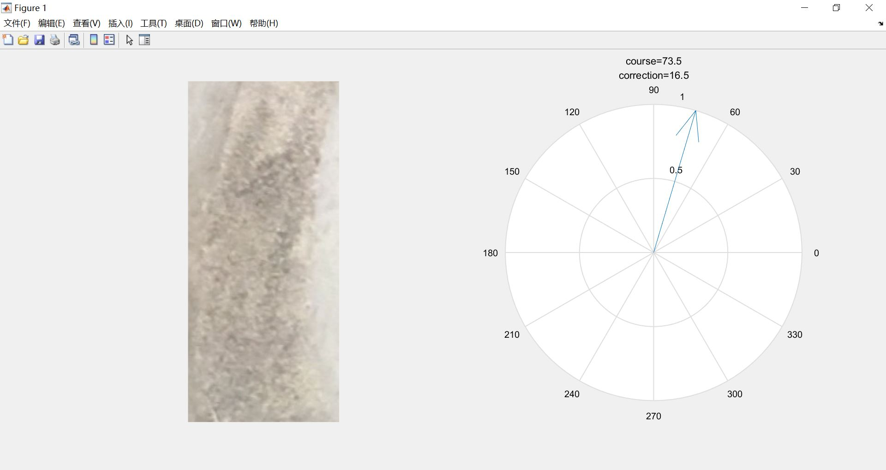
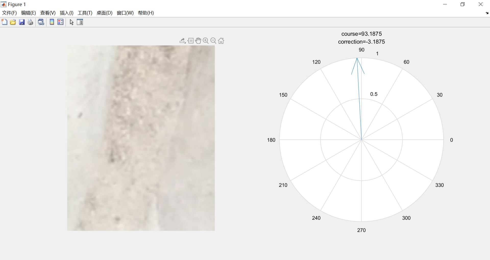
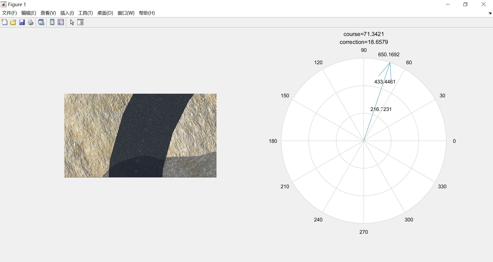
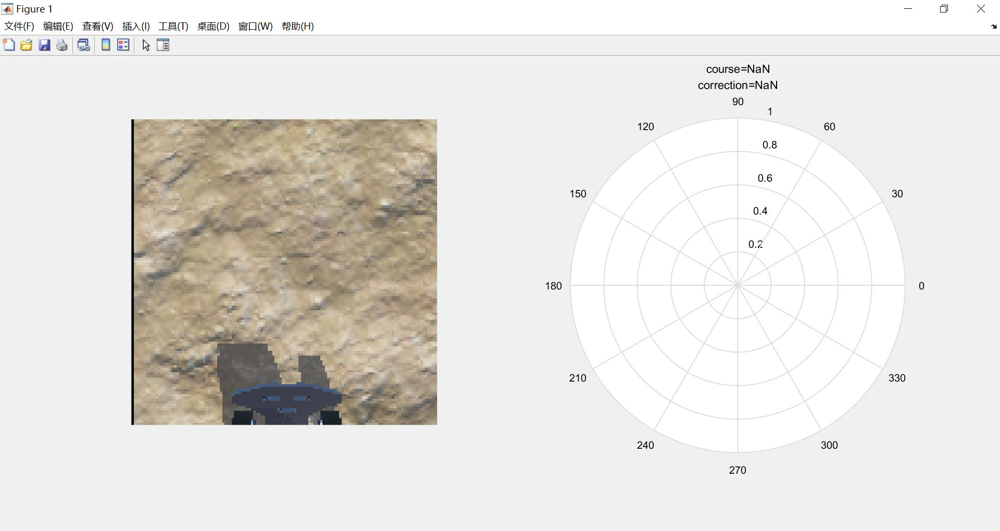
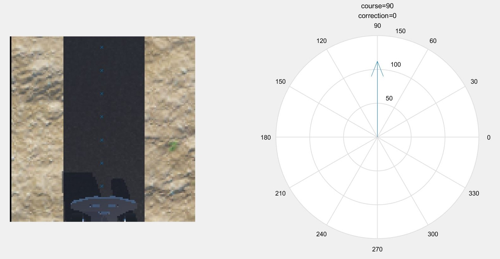
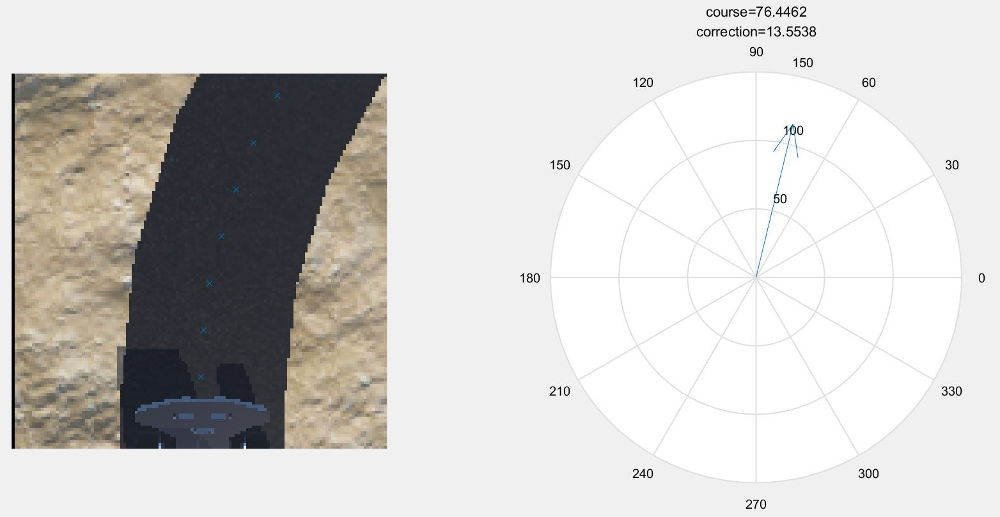
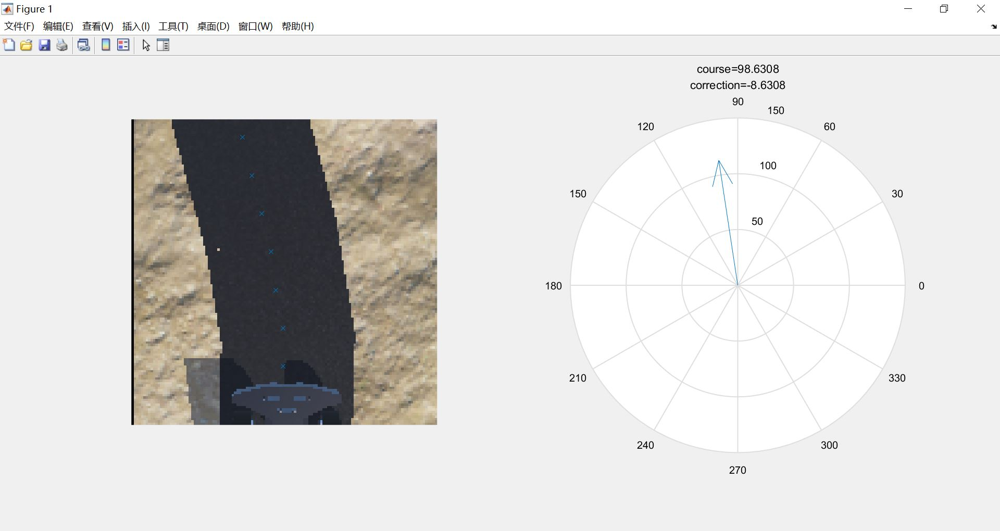
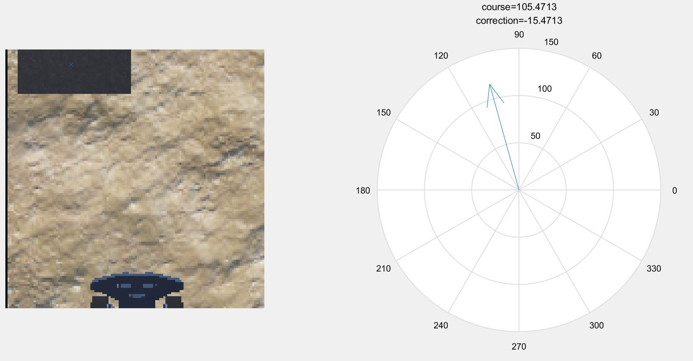

***Laboratory Record***

TDPS Path detection and following algorithm development 
WEN Bo 
UoG ID: 2357658W
UESTC ID: 2017200505025

Experiment Date: 150320-180320; 280420-200520

Purpose: To design an algorithm which can detect the path from the camera and give proper instruction of maneuvering to the car in order to guide the car to stay with the path and follow it.

Instruments: Webots\MATLAB

Procedure and results:

​    150320-180320:ver. 1.0 (elementary coding based on real world photos)

​    Algorithm based on edge detection: 

1.   Image preprocessing
2.   Extract gradient features
3.   Using the idea of histogram to eliminate other strong gradient noise in the image
4.   Develop a sub-algorithm to use the direction of the path edge to determine direction of the path
5.   Calculate the correction angle


   MATLAB Code (demo version):

```matlab
%高斯滤波+梯度计算

%TDPS_path1选取图像中前num位梯度最大点以确定路径边缘方向，
%再将边缘方向转置90度得到路径方向

%TDPS_path2较TDPS_path1由直接地选取前num位梯度最大点改为
%对一定阈值以上的梯度点的方向进行直方图统计，取点数最多的方向作为边缘方向，
%部分改善了路面污点和图像噪声对方向判别的干扰

%TDPS_path3较TDPS_path2将图像在排方向上等分为n段，
%分别求每段内的最多方向，再将n段求平均值以改善弯道处方向判别性能
%并且优化了语句，改善运算速度
clc;clear all;close all;
A=imread('C:\Users\文博\Desktop\s型弯道3.0\l3.jpg');

W = fspecial('gaussian',[5,5],1); 
B = imfilter(A(:,:,1), W, 'replicate');
[Gmag, Gdir] = imgradient(B,'prewitt');%高斯滤波+求梯度


piece=4;%图像分割段数
cuttedgmag=size(Gmag,1)-rem(size(Gmag,1),piece);%将图像裁剪为分割段数的整数倍
newGmag=Gmag(1:cuttedgmag,:);%裁剪后的梯度模
newGdir=Gdir(1:cuttedgmag,:);%裁剪后的梯度方向
newsize=cuttedgmag/piece;%每段图像的宽度

%将分割后的图像装入一个三维矩阵中，方便后面操作
Gmags=zeros([newsize size(Gmag,2) piece]);
for i=1:1:piece
    Gmags(:,:,i)=newGmag(1+(i-1)*newsize:i*newsize,:);
end
%imshowpair(A,Gmags(:,:,1),'montage');
%test
finalcourse=zeros([piece 1]);
for k=1:1:piece %各段图像
    course=zeros([360 1]); %用于统计高于某阈值的梯度方向即像素点个数
    rdir=0;%用于记录每一符合要求点的梯度方向
    
    for i=1:1:size(Gmags,1)
      for j=1:1:size(Gmags,2)%扫描图像 
        if Gmags(i,j,k)>170 %阈值
          rdir=floor(newGdir(i+(k-1)*newsize,j)); %记录方向，取整
          if rdir<=0
            course(rdir+360,1)=course(rdir+360,1)+1; %将-179至+180度的梯度统计存放在1-360的数组中
          elseif rdir>0
            course(rdir,1)=course(rdir,1)+1;
          end  
          %course中角度与矩阵序号的对应以及后面每象限maxdq角度与矩阵序号的对应
          %序号         方向     象限序号      方向
          %1.....<-.......1       1.....<-.......1
          %.              .       .              .
          %.              .       90....<-......90 
          %90....<-......90       ----------------
          %.              .       1.....<-......91
          %.              .       .              .
          %180...<-.....180       90....<-.....180
          %---------------------------------------      
          %181...<-...(-179)      1.....<-...(-179)
          %.              .       .              .
          %.              .       90....<-....(-90)
          %270...<-....(-90)      ----------------
          %.              .       1.....<-....(-89)
          %.              .       .              .
          %360...<-.......0       90....<-.......0
        end
      end
    end
 
    maxdq=zeros([4 1]);%选取各象限符合条件的像素点最多的方向
    [val1 maxdq1]=max(course(1:90,1));
    [val2 maxdq2]=max(course(91:180,1));
    [val3 maxdq3]=max(course(181:270,1));
    [val4 maxdq4]=max(course(271:360,1));
    
    nullchecker=[1 1 1 1];
    if val1==0
        nullchecker(:,1)=0;
    end
    
    if val2==0
        nullchecker(:,2)=0;
    end
    
    if val3==0
        nullchecker(:,3)=0;
    end
    
    if val4==0
        nullchecker(:,4)=0;
    end
    
    maxdq(1)=maxdq1;
    maxdq(2)=maxdq2+90;
    maxdq(3)=maxdq3-180;
    maxdq(4)=maxdq4-90;
    
    for i=1:1:4 %将边缘方向按左右转置90度得到路径方向
       if maxdq(i)<=90 && maxdq(i)>=-90
         maxdqc(i)=maxdq(i)+90;
       elseif maxdq(i)>90
         maxdqc(i)=maxdq(i)-90;
       elseif maxdq(i)<-90
         maxdqc(i)=maxdq(i)+270;
       end
    end
    
    validquarter=0;
    for i=1:1:4
        if nullchecker(i)==1
            validquarter=validquarter+1;
        elseif nullchecker(i)==0
            maxdqc(i)=0;
        end
    end
        
    finalcourse(k)=sum(maxdqc)/validquarter;%该段图像的总方向    
    
end
 
avefinalcourse=mean(finalcourse);%图像最终方向为每段总方向求均值


% 作图
pathdx=cosd(avefinalcourse);
pathdy=sind(avefinalcourse);

subplot(1,2,1);
hold on;
imshow(A);
hold off
subplot(1,2,2);
compass(pathdx,pathdy);

title({['course=',num2str(avefinalcourse)];['correction=',num2str(90-avefinalcourse)]});
```


Results:







280420-010520: ver. 2.0 (elementary coding based on Webots camera output)

​    Algorithm based on grayscale analysis: 

1.   Image preprocessing

2.   Extract grayscale features

3.   Determine the trajectory of the path base on the identified path pixel

4.   Calculate the correction angle

   

   MATLAB Code:

```matlab
clc;clear all;close all;
img=imread('C:\Users\文博\Desktop\s型弯道3.0\r1.jpg');

A=rgb2gray(img);

n=16;
height=size(A,1)-mod(size(A,1),n);
length=size(A,2)-mod(size(A,2),n);
B=A(1:height,1:length);
% 
for i=1:n:height
    for j=1:n:length
        k=mean(B(i:i+n-1,j:j+n-1),'all');
        map=repmat(k,[n n]);   
        C(i:i+n-1,j:j+n-1)=map; 
 
    end
end

for i=1:1:size(C,1)
    for j=1:1:size(C,2)
       if C(i,j)<70
           C(i,j)=0;
       else
           C(i,j)=100;
       end
    end
end

piece=8;%图像分割段数
cuttedC=size(C,1)-rem(size(C,1),piece);%将图像裁剪为分割段数的整数倍
newC=C(1:cuttedC,:);
newsize=cuttedC/piece;%每段图像的宽度

%将分割后的图像装入一个三维矩阵中，方便后面操作
D=zeros([newsize size(C,2) piece]);
for i=1:1:piece
    D(:,:,i)=newC(1+(i-1)*newsize:i*newsize,:);
end


for k=1:1:piece
    [locationx,locationy]=find(D(:,:,k)==0); 
    fy(k)=floor(mean(locationx))+(k-1)*newsize;
    fx(k)=floor(mean(locationy));
end

% for i=1:1:piece-1
%    diff(1,i)=fx(i)-fx(i+1);
%    diff(2,i)=fy(i+1)-fy(i);
% end
diffx=fx(1)-fx(piece);
diffy=fy(piece)-fy(1);

% pathx=mean(diff(1,i));
% pathy=mean(diff(2,i));
degree=atan2d(diffy,diffx);

subplot(1,2,1);
hold on;
imshow(img);
plot(fx(:),fy(:),'x');
hold off;
subplot(1,2,2);
compass(diffx,diffy);
title({['course=',num2str(degree)];['correction=',num2str(90-degree)]});
```


Results:





100520-150520:ver. 3.0 (Algorithm update)

​    Code update base on version 2.x to allow the algorithm to give more accurate instructions and be able to not just detect and follow the path but also search the path, in order to guide the car to move towards the entrance of the path in task 4. Also allowing the code to deal with the scenario of no path in view.

1.   Image preprocessing

2.   Extract grayscale features

3.   Determine the trajectory of the path base on the identified path pixel

4.   Analyze the geometric relationship between the car and the path

5.   Determine the target point in the image base on geometric relationship

6.   Calculate the correction angle

   

   MATLAB Code:

```matlab
clc;clear all;close all;%清屏、初始化
img=imread('C:\Users\文博\Documents\GitHub\Mihotel\test\camera\3\2020-05-20-10-13-40.png');%读图
A=rgb2gray(img(:,2:end,:));
%裁切掉图像最左边一列的黑边
%彩色转为灰色
%储存在二维数组A中


%% 图像分割与路径计算
piece=8;
%piece为图像竖直方向分割块数（可调整）

cuttedA=size(A,1)-rem(size(A,1),piece);
%cuttedA为小于图像高度的最大piece倍数
newsize=cuttedA/piece;
%newsize为竖直方向分割后每一段的高度

threshold=70;
%灰度判定的阈值（可调整）

for k=1:1:piece %按分段逐一读图
    [locationy,locationx]=find(A(1+newsize*(k-1):newsize*k,:)<threshold); 
    %找出该段中所有灰度值小于上述阈值的像素点，
    %并储存其坐标至locationy（竖直方向）、locationx（水平方向）
    fy(k)=floor(mean(locationy))+(k-1)*newsize;
    %计算该段中所有符合灰度要求的点的y方向中心
    % +(k-1)*newsize是为了将数组裁切后的每行的序号与裁切前对应
    fx(k)=floor(mean(locationx));
    %计算该段中所有符合灰度要求的点的x方向中心
    
    if k==piece
        fy(k)=NaN;
        fx(k)=NaN; 
    %最底部一段因为有小车，不参与道路的判别
    
%     elseif k~=1 & size(locationy)<300
%         fy(k)=NaN;
%         fx(k)=NaN; 
    %符合灰度要求像素点极少的分段，其实际图形中心在一些特殊情况下与上述方法所计算的图形中心出入过大，因此忽略
    %暂时不用
    end
    
end

startelement=min(find(isnan(fx)));
%找到开始没有道路的分段

if startelement==1
    pathstart=[NaN,NaN];
    startseg=1;
%startseg记录道路开始的图像段数
%pathstart记录了开始有道路的那一段的道路的图形中心位置
%如果从最顶部的一段开始就没有道路，那么开始段设为空值
else
    pathstart=[fy(startelement-1),fx(startelement-1)]; 
    startseg=startelement-1;
%否则将从上到下最后一个有道路的分段作为开始分段
end

%% 小车位置定义
carlocation=[120,64];%小车图形中心
car_leftedge=42;%小车左边缘列数
car_rightedge=87;%小车右边缘列数

%% 修正角度计算
if fx(1:startseg)<car_leftedge %当道路完全位于小车左边时（小车位置右偏严重）
    if fx(1)<pathstart(2) %如果道路方向向外
        %那么将道路的起始段的中心作为前进目标
        diffx=pathstart(2)-carlocation(2);
        diffy=carlocation(1)-pathstart(1);
        degree=atan2d(diffy,diffx);
    elseif fx(1)>=pathstart(2) %如果道路方向向内
        %那么直接将道路的最顶端一段的中心作为前进目标
        diffx=fx(1)-carlocation(2);
        diffy=carlocation(1)-fy(1); 
        degree=atan2d(diffy,diffx);
    end
elseif fx(1:startseg)>car_rightedge %当道路完全位于小车右边时（小车位置左偏严重）
    if fx(1)>pathstart(2) %如果道路方向向外
        %那么将道路的起始段的中心作为前进目标
        diffx=pathstart(2)-carlocation(2);
        diffy=carlocation(1)-pathstart(1);
        degree=atan2d(diffy,diffx);
    elseif fx(1)<=pathstart(2)  %如果道路方向向内
        %那么直接将道路的最顶端一段的中心作为前进目标
        diffx=fx(1)-carlocation(2);
        diffy=carlocation(1)-fy(1); 
        degree=atan2d(diffy,diffx);
    end
else %当小车位置没有相对于道路左偏或右偏严重时
   %直接将道路的最顶端一段的中心作为前进目标
   diffx=fx(1)-carlocation(2);
   diffy=carlocation(1)-fy(1);   
   degree=atan2d(diffy,diffx);
end

amendment_angle=90-degree;%修正角度（左负右正）
if amendment_angle>45
    amendment_angle=45;
elseif amendment_angle<-45
    amendment_angle=-45;
end
%角度限制（不得大于45度），避免小车转向过大造成的图像横置，导致可能下一次无法识别路径

%% 作图演示
% subplot(1,2,1);
% hold on;
% imshow(img);
% plot(fx(:),fy(:),'x');
% hold off;
% subplot(1,2,2);
% compass(diffx,diffy);
% title({['course=',num2str(degree)];['correction=',num2str(amendment_angle)]});
```


Results:












190520-200520: ver. 4.0 Optimize the coding.


Conclusion

The development of this algorithm takes a long period and experience several changes in scope and requirement. But I manage to find a relatively highly efficient method to solve the task. And further conversion, implantation and optimization of this algorithm is handled to my teammate HAN Haoran.