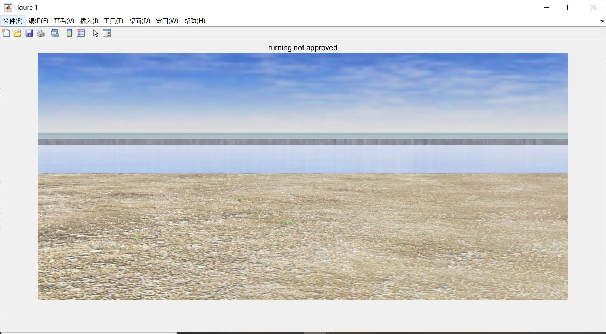
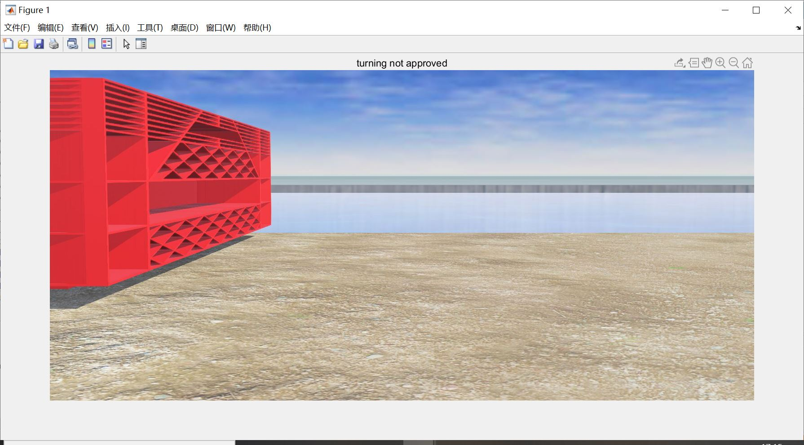
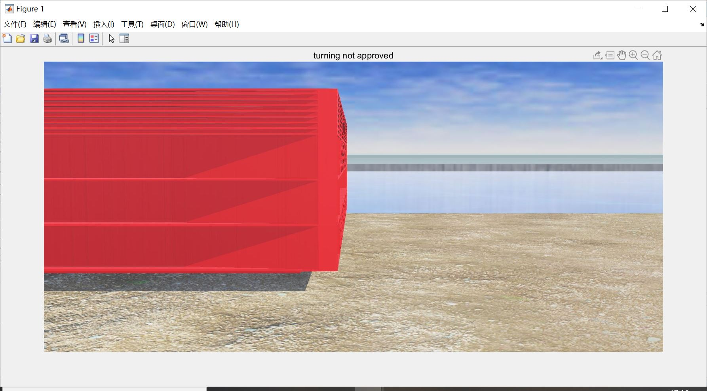
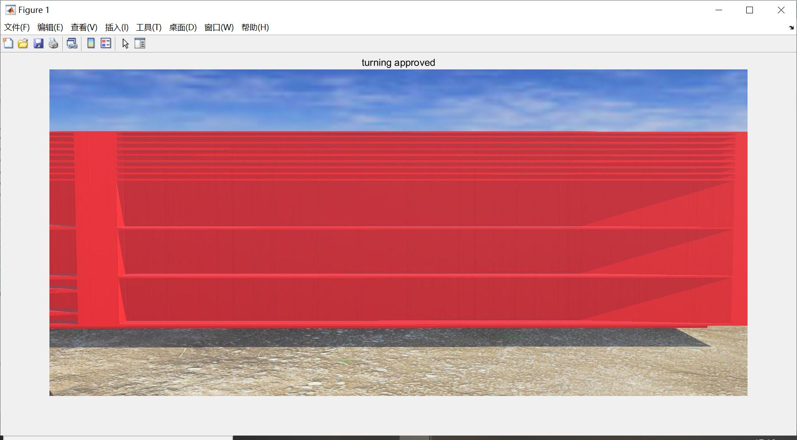

***Laboratory Record***

TDPS Fish tank detection algorithm experimental development 
WEN Bo 
UoG ID: 2357658W
UESTC ID: 2017200505025

Experiment Date: 280420

Purpose: To design an algorithm which can detect the tank the rover aims to drop feeds for fish and give "drop" instruction when the location of the rover is determined proper.

Instruments: Webots\MATLAB

Procedure and results:

​    Algorithm based on color distribution analysis: 

1.   Image preprocessing
2.   Extract color features
3.   Analysis the distribution of certain colors in the image to determine the relative location between the tank and the car.
4.   Give instruction


MATLAB Code:

```matlab
clc;clear all;close all;
img=imread('C:\Users\文博\Desktop\tank\t6.jpg');

imgblue=img(:,:,3);
status=0;

a=zeros([size(img,1) 1]);

for i=1:1:size(img,1)
    if imgblue(i,:)<100
        status=1;
        a(i)=i;
    end
end
```


Results:










Conclusion

This is only an experimental algorithm, this task is later reassigned to my teammate SHU Chang and our final solution for it is base on his color detection algorithm.