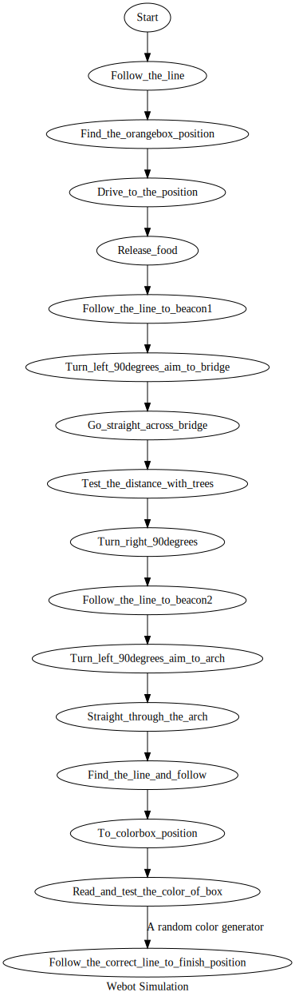
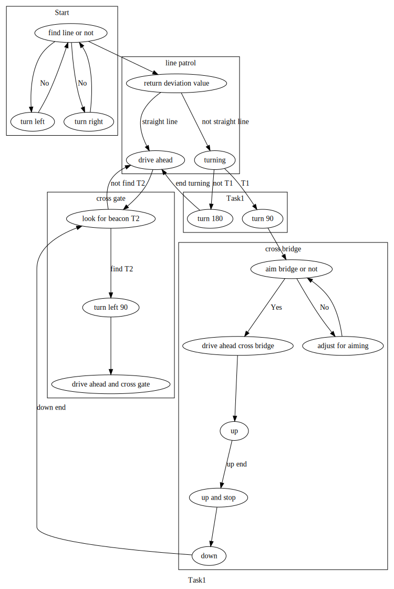
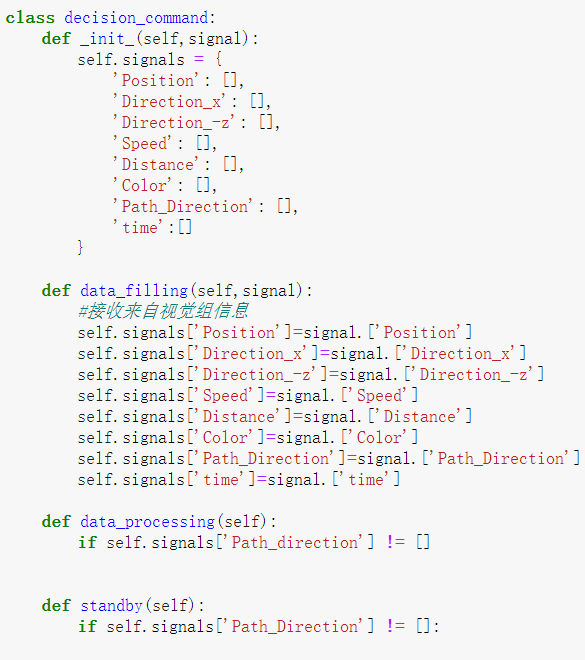
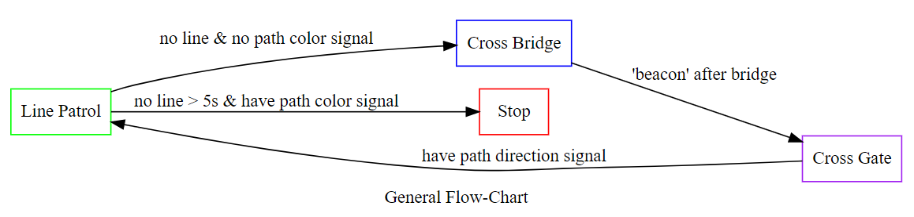
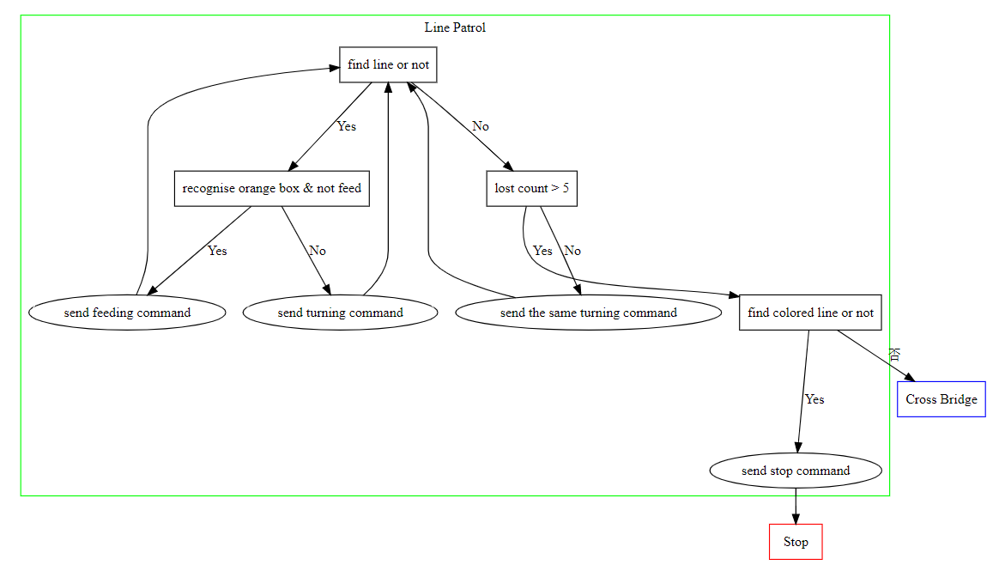
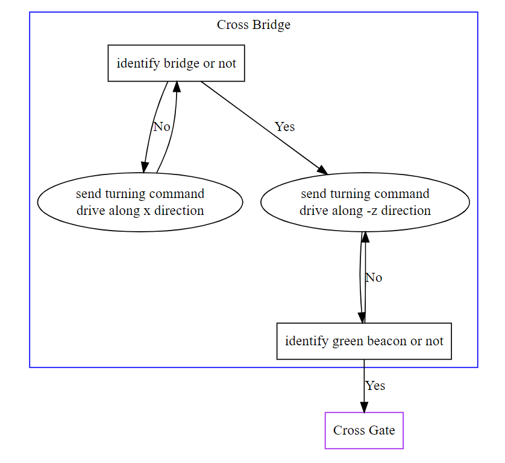
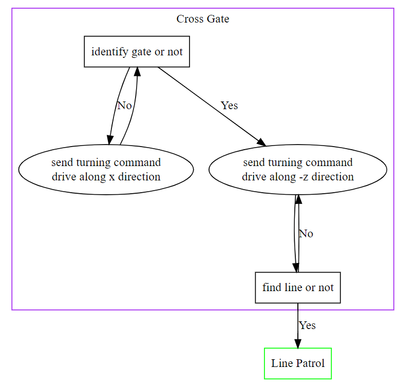

### Subject: Make the initial flow chart of simulation on Webots

#### Date: <u>April 18</u>   Author: <u>Zijian Wang</u>

##### Purpose: 

We just get the new simulation process. After the meeting with my partner Hanpeng Xu, we check each task in the process and make our initial flow chart which can also be used to show on our week 9 meeting.

##### Procedure:

1. Hold a meeting with Hanpeng Xu, discuss the simulation process
2. Draw the flow chart by Graphviz


##### Results:



### Subject: <u>Check task details and make a command logic diagram</u>

#### Date: <u>May 7</u>   Author: <u>Zijian Wang</u>

##### Purpose: 

After the discussing meeting with Hanpeng Xu, I make a logic diagram based on the task requirement in ppt, last flow chart and the meeting record. It can lead us to write the python code of decision to receive signals from vision group and send commands to chassis group to finish our project.

##### Procedure:

1. Hold a meeting with Hanpeng Xu, discuss the details and get a primary plan
2. Draw the logic diagram by Graphviz

##### Result:

The Graphviz code is shown below.

```python
digraph Task1 {
    label="Task1"
    compound=true;
    subgraph cluster0 {
        label="Start"
        "find line or not" -> "turn left" [label="No"]
        "find line or not" -> "turn right" [label="No"]
        "turn left" -> "find line or not"
        "turn right" -> "find line or not"
    }
    subgraph cluster1 {
        label="line patrol"
        "return deviation value" -> "drive ahead" [label="straight line"]
        "return deviation value" -> "turning" [label="not straight line"]
    }
    subgraph cluster2 {
        "turn 180"
        "turn 90"
    }
    subgraph cluster3 {
        label="cross bridge"
        "aim bridge or not" -> "drive ahead cross bridge" [label="Yes"]
        "aim bridge or not" -> "adjust for aiming" [label="No"]
        "adjust for aiming" -> "aim bridge or not"
        "drive ahead cross bridge" -> "up"
        "up" -> "up and stop" [label="up end"]
        "up and stop" -> "down"
    }
    subgraph cluster4 {
        label="cross gate"
        "look for beacon T2" -> "turn left 90" [label="find T2"]
        "look for beacon T2" -> "drive ahead" [label="not find T2"]
        "drive ahead" -> "look for beacon T2"
        "turn left 90" -> "drive ahead and cross gate"

    }
    "find line or not" -> "return deviation value"
    "turning" -> "turn 180" [label="not T1"]
    "turning" -> "turn 90" [label="T1"]
    "turn 180" -> "drive ahead" [label="end turning"]
    "turn 90" -> "aim bridge or not"
    "down" -> "look for beacon T2" [label="down end"]
}
    
```
The logic diagram is shown below.



### Subject: <u>Divide the states and start writing decision code</u>

#### Date: <u>May 21</u>   Author: <u>Zijian Wang</u>

##### Purpose:

In order to write the decision code part, we organize a discussion with chassis and visual group. It helps us a lot to make our process clear, and we also check some necessary key point, such as the feeding part, the turning part and the beacon part. We make a list of signal type and the command type which we can send to the car.

##### Procedure:

1.	Organize meetings with chassis and visual group
2.	Clear some key points in our process
3.	Divide the whole process into several states
4.	Start to code

##### Results:

##### Line patrol：

Recognize path angle and update speed

（End：if x>-10）

##### feed：
Start：x>-10

Line patrol，identify orange box，feed when aim to the box

End：finish line patrol

##### Drive without line x：
###### 1.
Start：path camera no path signal

Start left camera，recognize angle between car and x direction，update new speed

End：left camera aims to bridge

###### 2.
Start：cross bridge beacon（need to discuss）

stop，turn right，recognize angle between car and x direction

End：angle = 0

Start left camera，move 19m along x direction

End：left camera aims to gate

##### Drive without line y：
###### 1.	Cross bridge
Start：left camera aims to bridge

stop，turn left

End：bridge enters the center of camera field

recognize angle between car and y direction，update new speed

End：cross bridge beacon（need to discuss）

###### 2.	Cross gate

Start：left camera aims to gate

stop，turn left

End：gate enters the center of camera field

recognize angle between car and y direction，update new speed

End：path camera find path signal，turn to line patrol state

##### stop：
distance <= 1m，stop


The initial dicision code is shown below.




### Subject: <u>Complete the line patrol state</u>

#### Date: <u>May 24</u>   Author: <u>Zijian Wang</u>

##### Purpose:

Based on the graph and what we have discussed before, we finish the initial line patrol logic code.

##### Procedure:

1.	Have meeting with team leader, Zhuheng Song, have a full understand of our system code.
2.	Finish the line patrol part, with partner Hanpeng Xu.


##### Results:

The code is shown below.

```python
class Decider(object):
    '''
    Decider class
    '''

    def __init__(self, flag_patio_finished):
        self.flag_patio_finished = flag_patio_finished
        self.signals = {}
        self.states = {
            'line patrol': self.line_patrol,
            'feed': self.feed,
            'stop': self.stop,
        }
        self.current_state = 'line patrol'
        info('Decision initialed')

# ############################# state functions ################################
    def line_patrol(self):
        '''
        巡线
        '''
        # 在程序刚开始时可能这个量还没有传过来, 所以先判断下有没有
        if 'Path_direction' in self.signals:
            if self.signals['Path_direction'] is None:
                return 'stop'
            self.send_command('Turn' + str(self.signals['Path_direction']))
            self.send_command('Move_Forward')
        return 'line patrol'

    def feed(self):
        '''
        投食
        '''
        pass

    def lineless_x_axis(self):
        '''
        无线直行x轴
        '''
        self.send_command('Turn' + str(self.signals['Direction_x']))

    def lineless_z_axis(self):
        '''
        无线直行-z轴
        '''
        self.send_command('Turn' + str(self.signals['Direction_-z']))

    def cross_bridge(self):
        self.lineless_x_axis()
        # 此处缺个转弯，明天与视觉组商定
        self.lineless_z_axis()
        self.send_command(self.command['2'] + ' Angle:' + self.signals['Path_Direction'])

    def stop(self):
        '''
        测试用
        '''
        self.send_command('Stop')
        return 'stop'
```

### Subject: <u>Finish the initial whole process</u>

#### Date: <u>May 27</u>   Author: <u>Zijian Wang</u>

##### Purpose:

Finish the cross bridge and cross gate part with partner, Hanpeng Xu.

##### Procedure:

1.	Finish cross bridge state.
2.	Finish cross gate state.

##### Results:

The code is shown below.

```python
def cross_bridge(self):
        '''
        过桥逻辑
        '''
        if self.signals['Bridge_Detection'] is False and self.signals['Gate_Detection'] is False:
            # 过桥前直行x
            self.send_command('Turn' + str(-self.signals['Direction_x']))
            return 'cross_bridge'
        elif self.signals['Bridge_Detection'] is True and self.signals['Gate_Detection'] is False:
            # 对准桥左转向-z直行，>=10转90，<10直行
            if abs(self.signals['Direction_-z']) >= 10:
                self.send_command('Turn-90')
            elif abs(self.signals['Direction_-z']) < 10:
                self.send_command('Turn' + str(-self.signals['Direction_-z']))
            return 'cross_bridge'
        elif self.signals['Beacon'] == 'after bridge':
            # 过桥后右转，>=10转90，<10切换过门状态
            if abs(self.signals['Direction_x']) >= 10:
                self.send_command('Turn90')
                return 'cross_bridge'
            elif abs(self.signals['Direction_x']) < 10:
                return 'cross_gate'

    def cross_gate(self):
        '''
        过门
        '''
        if self.signals['Bridge_Detection'] is True and self.signals['Gate_Detection'] is False:
            # 过门前直行x
            self.send_command('Turn' + str(-self.signals['Direction_x']))
            return 'cross_gate'
        elif self.signals['Bridge_Detection'] is True and self.signals['Gate_Detection'] is True:
            # 对准门左转向-z直行，>=10转90，<10直行
            if abs(self.signals['Direction_-z']) >= 10:
                self.send_command('Turn-90')
            elif abs(self.signals['Direction_-z']) < 10:
                self.send_command('Turn' + str(-self.signals['Direction_-z']))
            return 'cross_gate'
        elif self.signals['Path_Direction'] is not None:
            # 过门后切换巡线状态
            return 'line_patrol'

    def stop(self):
        '''
        End
        '''
        self.send_command('Stop')
        return 'stop'
```

### Subject: <u>Finish the state logic graph and general flow chart</u>

#### Date: <u>June 3</u>   Author: <u>Zijian Wang</u>

##### Purpose:

It’s easy to show our decision logic and help us make a check.

##### Procedure:

1.	Finish general flow chart
2.	Finish 3 state logic graphs


##### Results:




