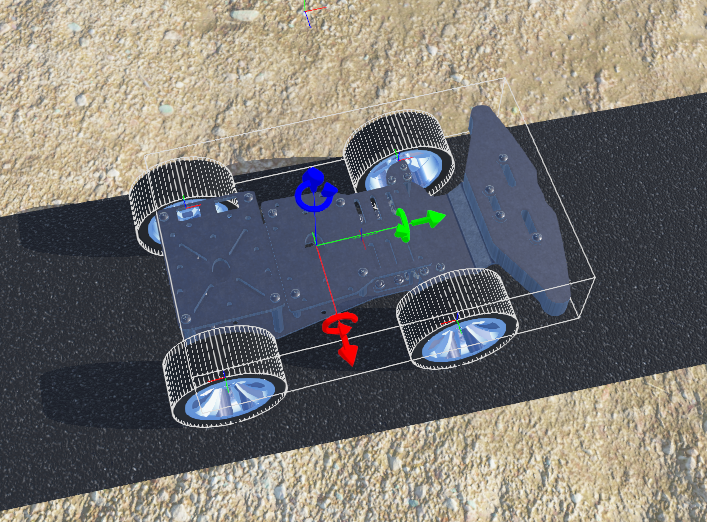
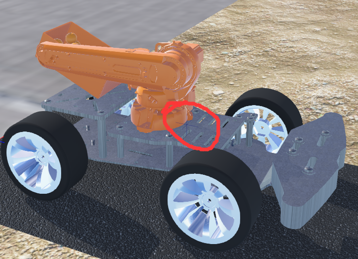
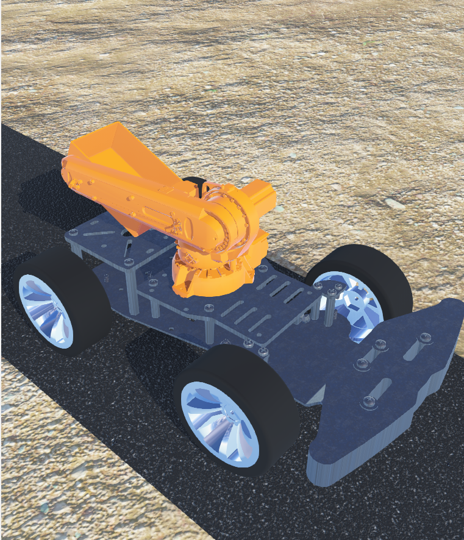
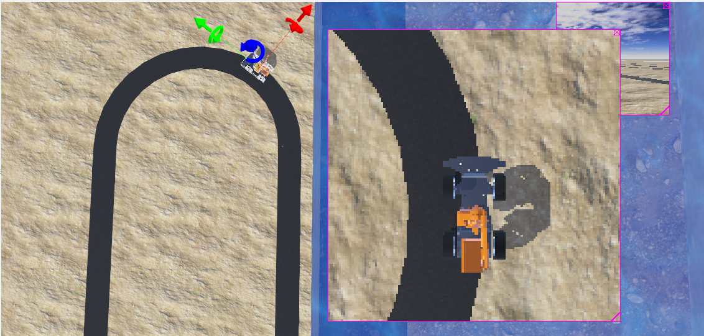
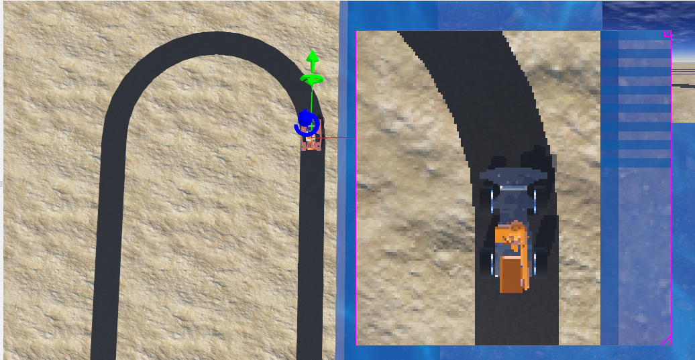
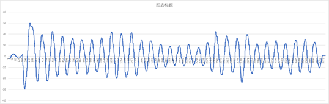
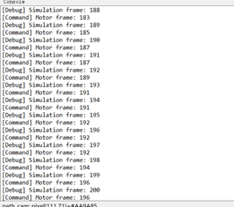
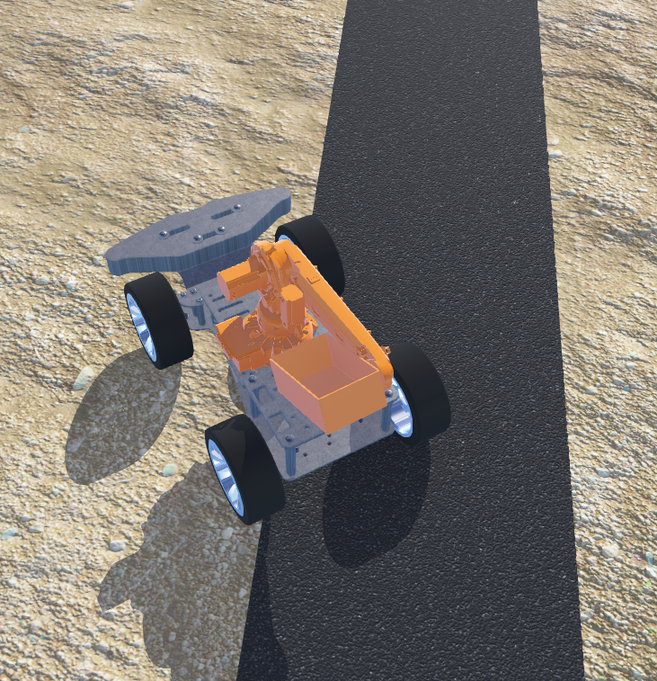

### Subject: Adjust the centre of mass

#### Date: <u>May 10</u>   Author: <u>Shi Chaofan

##### Purpose: 

to solve the rotation problem. when we want it rotate in place, the centre of mass will move around the centre, if the speed is fast, the car will even fall apart
##### Procedure:

This experiment contains two parts:

1. modify the texture of the land
2. compare our car to the car in the tutorial

##### Results:

we finally found the reason is caused by the centre of mass, so i moved the bounding object of the car and adjust the position to solve the problem

### Subject: write the control code of arm

#### Date: <u>May 20</u>   Author: <u>Shi Chaofan

##### Purpose: 

we want to control the arm so, we can release the fish food both safely and elegantly. 

##### Procedure:

This experiment contains three parts:

1. directly set position of the motor
2. set speed and time
3. add position limitation

##### Results:

in fact, we choose to set its position directly at first, however, in the former version, we choose to throw the food without stop, so we have to set speed and us position limitation, because we can not precisely control the number of loops during a period.

### Subject: adjust the pid control of the chasiss

#### Date: <u>June 1</u>   Author: <u>Shi Chaofan

##### Purpose: 

we want to move the car as soon as possible and finish the whole project.
because the chassis only receive the angle then change it to speed, the only thing is to write a pid program to transfer angle to speed.

##### Procedure:

This experiment contains three parts:

1. directly us pid control and modify the constant
2. set timestep limitation
3. reduce the id control because its not necessary for performance

##### Results:

the result is shown on the video, the latest version is the slow one, the video mod is the fast one.

### Subject: resolve the losing frame problem

#### Date: <u>June 3</u>   Author: <u>Shi Chaofan

##### Purpose: 

we modify the loop without the limitation, however, the car became instable

##### Procedure:

This experiment contains three parts:

1. we tested a lot of times and then decide to add the limitation back

##### Results:

from above data we can clearly see that, the frame has 3 or more loss in each frame, and the car Shock greatly, thus we have to add the limitation back although we can get a faster simulation speed without the limitation.