***Laboratory Record***

TDPS (left-camera) Bridge and Gate detection algorithm development 
WEN Bo 
UoG ID: 2357658W
UESTC ID: 2017200505025

Experiment Date: 290420-010520; 200520-250520

Purpose: To design an algorithm which can use the left camera of the car to detect the gate and bridge and determine whether the car is at the proper location to cross the bridge/ go through the gate

Instruments: Webots\MATLAB

Procedure and results:

​    290420: Preliminary bridge detection

1. Image preprocessing
2. Gradient feature extraction to find pixel of bridge
3. Image erosion
4. Determine the bridge and its geometric center
5. Determine the 'cross' instruction base on the geometric relationship of  car and bridge center


   MATLAB Code:

```matlab
clc;clear all;close all;
img=imread('C:\Users\文博\Desktop\bridge\10.jpg');
A=rgb2gray(img);

n=16;
height=size(A,1)-mod(size(A,1),n);
length=size(A,2)-mod(size(A,2),n);
B=A(1:height,1:length);

for i=1:n:height
    for j=1:n:length
        k=mean(B(i:i+n-1,j:j+n-1),'all');
        map=repmat(k,[n n]);   
        C(i:i+n-1,j:j+n-1)=map; 
    end
end

[Gmag, Gdir] = imgradient(C,'prewitt');

for i=1:n:height
    for j=1:n:length
        m=mean(Gmag(i:i+n-1,j:j+n-1),'all');
        map=repmat(m,[n n]); 
        Gmagnew(i:i+n-1,j:j+n-1)=map;
    end
end

counter=0;
for i=1:1:height
    for j=1:1:length
        if Gmagnew(i,j)<0.2
            Gmagnew1(i,j)=100;
            counter=counter+1;
        else
            Gmagnew1(i,j)=0;
        end
    end
end


if counter>10000
    [ly,lx]=find(Gmagnew1==100);
    cx=floor(mean(lx));
    cy=floor(mean(ly));
    
    crossy=[1:32:size(img,1)];
    crossx=repmat(cx,[1 size(crossy,2)]);
    
    mid=size(img,2)/2;
    diff=mid-cx;
    
    subplot(2,1,1);
    imshow(img); hold on
    plot(crossx(:),crossy(:),'x');
    if abs(diff)>30
     title({['bridge identified'];['distance=',num2str(diff)];['DO NOT TURN!']});
    else 
     title({['bridge identified'];['distance=',num2str(diff)];['TURN NOW!']});
    end
    subplot(2,1,2);
    imshow(Gmagnew1);
else
    subplot(2,1,1);
    imshow(img);
    title({['no bridge'];['DO NOT TURN!']});
    subplot(2,1,2);
    imshow(Gmagnew1);
end
```


Results:

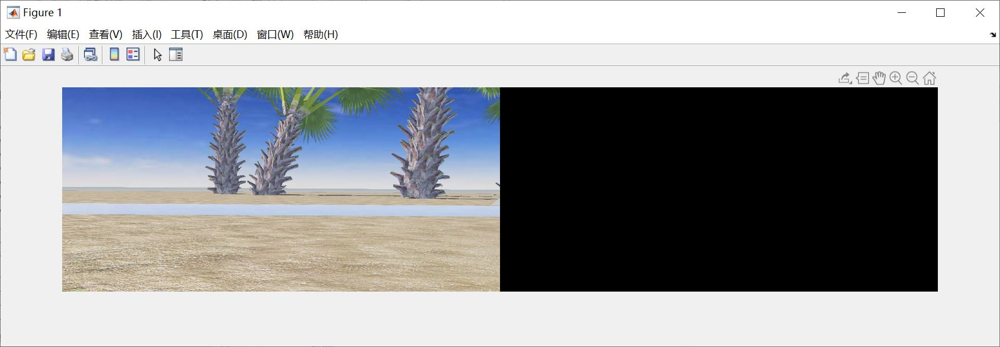

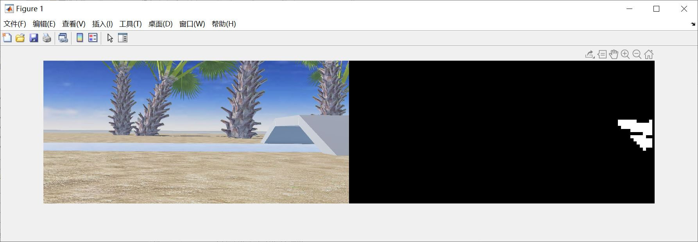

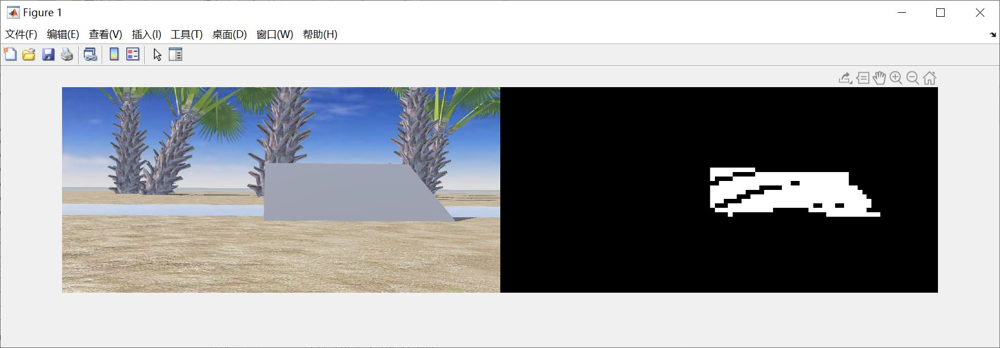

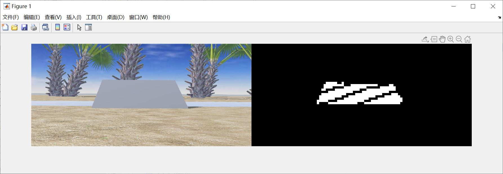


010520: Preliminary gate detection

1. Image preprocessing
2. Gradient feature extraction
3. A sub-algorithm to find the edge of the gate pillar
4. Edge column unification
5. Determine true edge columns
6. Analyze the geometric and quantity relationship of the pillar edges to give "go through" instruction .


   MATLAB Code:

```matlab
clc;clear all;close all;
img=imread('C:\Users\文博\Desktop\gate\g15.jpg');

imblue=img(:,:,3);

for i=1:1:size(img,1)
    for j=1:1:size(img,2)
        if imblue(i,j)<100
            imblue(i,j)=100;
        else
            imblue(i,j)=0;
        end
    end
end

[Gmag, Gdir] = imgradient(imblue,'prewitt');

record=zeros([1 size(Gmag,2)]);

for i=1:1:size(Gmag,1)
    for j=1:1:size(Gmag,2)
        if i<size(Gmag,1)-200 && Gmag(i+50,j)>200 && Gmag(i+100,j)>200 && Gmag(i+150,j)>200
            Gmag(i,j)=100;
        else
            Gmag(i,j)=0;
        end
    record(:,j)=sum(Gmag(:,j));
    if record(j)<(30*100)
        record(j)=0;
    end
    end
end

for j=1:1:size(record,2)-1
    if record(j)~=0 && record(j+1)~=0
        record(j)=0;
    elseif record(j)~=0 && record(j+1)==0
        record(j)=100;
    else
        record(j)=0;
    end
end

A=find(record==100);
sizeA=size(A,2);
meanA=mean(A);

if sizeA>5
condition=abs((A(5)+A(4))/2-meanA);
  if condition<10
    status=2;
  else
    status=1;
  end
elseif sizeA<=5 && sizeA>1
  status=1;
elseif sizeA<=1
  status=0;
end


subplot(1,1,1);
imshow(img); hold on
for i=1:1:size(A,2)
    plot(A(i),[100:100:300],'x');
end

switch status
    case 2
        title({['Gate identified: Turning allowed']});
    case 1
        title({['Gate identified: Turning not allowed']});
    case 0
        title({['Gate not identified: Turning not allowed']});
end
```


Results:

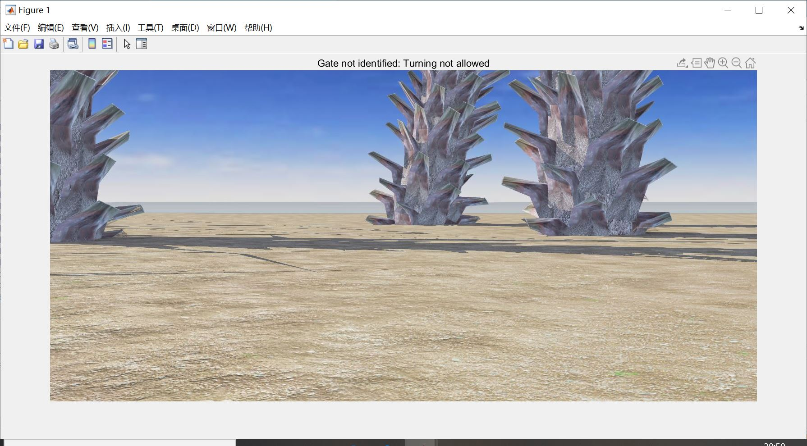

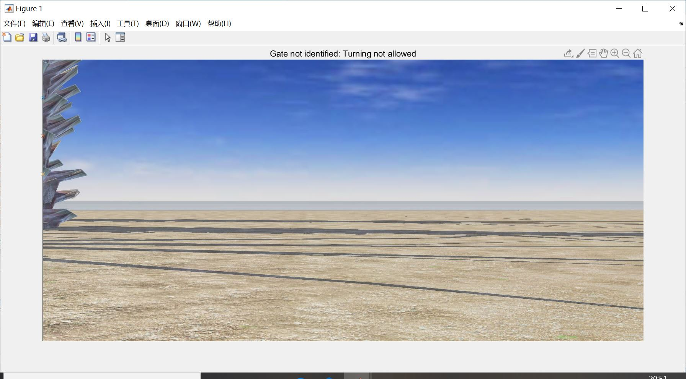

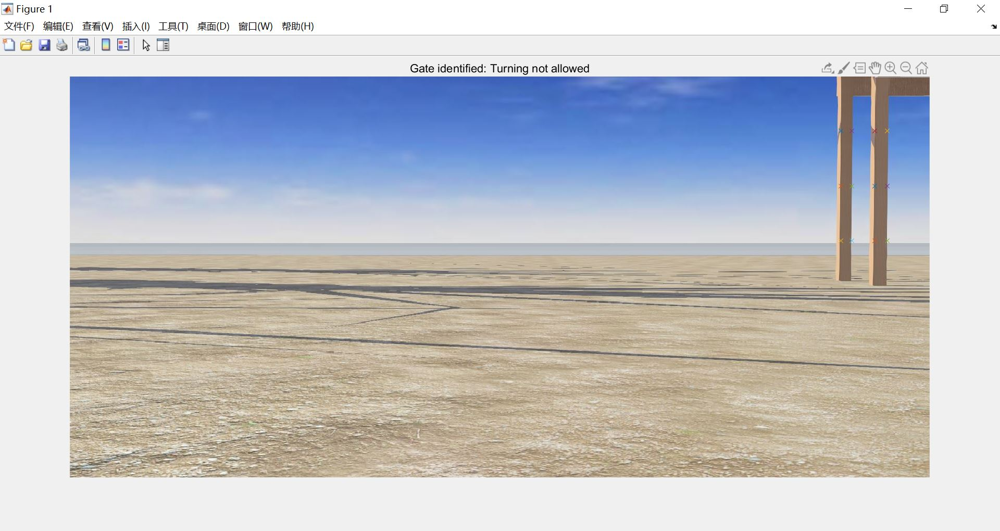

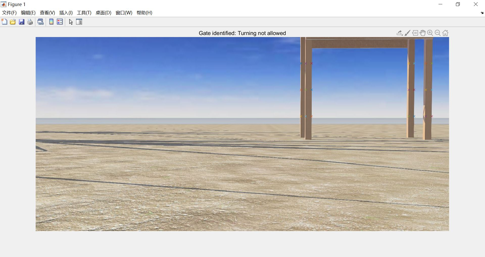

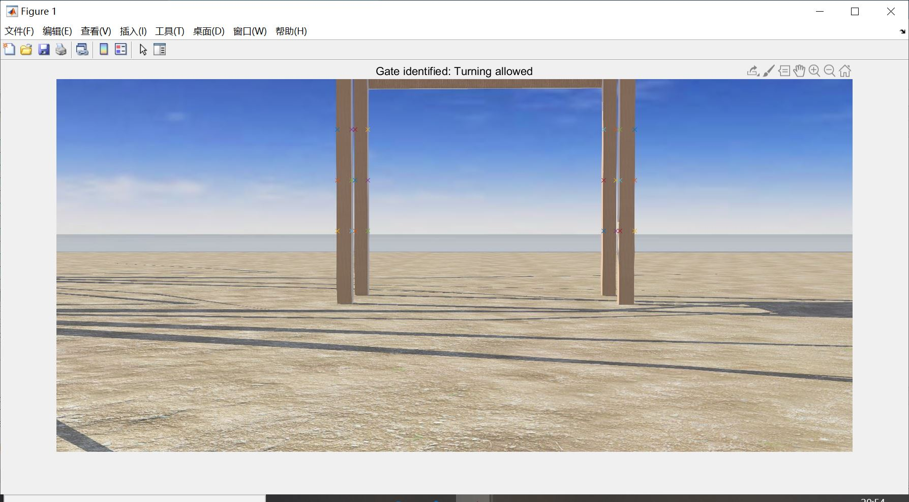


200520-250520: Algorithm optimization/ unify gate and bridge detection in one algorithm

1. Image preprocessing

2. Bridge detection

     (1) Grayscale feature extraction to find pixel of bridge

     (2) (Much) better erosion algorithm development

     (3) Determine the bridge and compute its geometric center

     (4) Determine the 'cross' instruction base on the geometric relationship of car and bridge center

3. Gate detection

     (1) Gradient feature extraction

     (2) Sub-algorithm to find the edge of the gate pillar (adjusted)

     (3) Edge column unification

     (4) Determine true edge columns

     (5) Analyze the geometric and quantity relationship of the pillar edges to determine "go through" instruction .

4. Determine the overall scenario based on how bridge and gate is detected and give final instruction.

   

   MATLAB Code:

```matlab
clc;clear all; close all;
img=imread('C:\Users\文博\Documents\GitHub\Mihotel\test\camera\1\2020-05-24-20-04-44.png');

A=rgb2gray(img);
[Gmag, Gdir] = imgradient(A,'prewitt');

%% 变量声明
%桥
bridgestatus=0;%=0:未识别到桥；=1：识别到桥，位置未对齐，不允许转向； =2：识别到桥，位置对齐，允许转向

grayscaleh=153;
grayscalel=149;%按灰度二值化的高低阈值

windowedge=9;%窗口大小，仅限奇数
windowhsize=(windowedge-1)/2;%窗口在目标像素前后、上下的距离

adjacentznum=30;%adjacent zeros number 窗口内临近的0像素个数

mid=64;%假定的小车中心位置
cx=NaN;%桥的中心位置

%门
gatestatus=0;%=0:未识别到门；=1：识别到门，位置未对齐，不允许转向；=2：识别到桥，位置对齐，允许转向
gradthres=350;%gradient_threshold, 梯度二值化分割标准

record=zeros([1 128]);%初始化用于记录门框边缘位置的矩阵
center=64;%假定的小车中心位置

edge=[];%用于记录门框位置的矩阵
sizeedge=0;%检测到的门框边缘数量


%% 桥
%提取图像中在特定灰度值范围内的像素点,统一赋值为0，其余赋值为1
for i=1:1:128
    for j=1:1:128
        if A(i,j)<=grayscaleh && A(i,j)>=grayscalel
           A(i,j)=0;
        else
           A(i,j)=1;
        end 
    end
end

%当以某一像素点为中心的矩形窗口内有超过adjacentznum个点都为0时，这个点才确认为桥像素点（=0），否则赋值为1
for i=1:1:128
    for j=1:1:128
        if i<windowhsize+1 || j<windowhsize+1 || i>128-windowhsize 
        %以windowhsize为宽度的左、上、下边缘内的像素点直接赋值为1，避免矩阵索引错误
            A(i,j)=1;
        elseif j>128-windowhsize
        %右边缘（桥出现的边缘）：只取窗口的左瓣进行判定（右瓣超出图像范围）
          if A(i,j)==0 
              Z=(A(i-windowhsize:i+windowhsize,j-windowhsize:j)==0);%统计选定窗口内0的个数
              if sum(Z(:))>adjacentznum-2 %0的个数超过阈值adjacentznum（这里因为只取左瓣，所以阈值取小一点（-2））
                A(i,j)=0;%确定这个像素点属于桥
              else
                A(i,j)=1;%否则这个像素点不属于桥
              end
          end
        else
        %图像除开四条边的中心部分，原理同右边缘，只是窗口是完整的正方形，判定阈值更大
          if A(i,j)==0
            Z=(A(i-windowhsize:i+windowhsize,j-windowhsize:j+windowhsize)==0);
            if sum(Z(:))>adjacentznum
                A(i,j)=0;
            else
                A(i,j)=1;
            end
          end   
        end
    end
end

counter=0;%统计图像中属于桥像素点的个数
for i=1:1:128
    for j=1:1:128
        if A(i,j)==0
            counter=counter+1;
        end
    end
end

if counter>=100 %如果桥像素点的个数>N：认为有桥
    [ly,lx]=find(A==0);%确定所有桥像素点在图像上的坐标（ly,lx）
    cx=floor(mean(lx));%计算桥在x轴方向上的中心
   
    diff=cx-mid;%小车中心与桥中心的偏差
    
    if abs(diff)<=5 %小车中心与桥中心偏差小于N个像素点，认为位置对齐
     bridgestatus=2; %情况一：识别到桥且位置对齐，允许转向
    else %否则认为位置未对齐
     bridgestatus=1; %情况二：识别到桥但位置未对齐，不允许转向
    end
else %未识别到门情况
    bridgestatus=0; %情况三：未识别到桥，不允许转向
    cx=NaN;
end


%% 门
for i=1:1:128 
    for j=1:1:128
      if Gmag(i,j)>gradthres
          Gmag(i,j)=1;
      else 
          Gmag(i,j)=0;
      end    
    end
end %按阈值将梯度图二值化

for i=1:1:128
    for j=1:1:128
        if i<128-5 && Gmag(i,j)==1 && Gmag(i+1,j)==1 && Gmag(i+3,j)==1
            Gmag(i,j)=1;%如果一个点以及它正下方第一、三个点都为零，那么这个点才确认为1
        else
            Gmag(i,j)=0;%否则归零
        end
      record(:,j)=sum(Gmag(:,j));%记录图像中每一列1的个数
        if record(j)<(3)%如果一列中1的个数小于3，这一列才认为有门框边缘（record不等于0）
            record(j)=0;%否则这一列1的个数归零
        end
    end
end %对门框边缘的检测与筛查

for j=1:1:128-1
    if record(j)~=0 && record(j+1)~=0 %如果一列以及它右边一列都是门框边缘（都不为0）
        record(j)=0; %那么这条边归零
    elseif record(j)~=0 && record(j+1)==0 %如果一列是门框边缘，但他右边一列不是，这一列确定为门框边缘位置
        record(j)=1;
    else
        record(j)=0;
    end
end %当一个门框边缘占据了连续的多列时，仅保留这连续几列的最右侧一列，且赋值为1，作为该条边缘的位置

edge=find(record==1);%根据record检索到门框边缘列数
sizeedge=size(edge,2);%计算检测到了几个门框边缘

if sizeedge>=2 %当至少检测到两个门框边缘：一条门框时，认为探测到桥
  if abs(mean(edge)-center)<3 %位置对齐
      gatestatus=2;
  else %位置未对齐
      gatestatus=1;
  end    
else %未识别到桥
    gatestatus=0;
end


%% 作图演示
status=[num2str(bridgestatus) num2str(gatestatus)];

crossy=[1:16:128];
crossx=repmat(cx,[1 size(crossy,2)]);

subplot(1,2,1);
imshow(img); hold on
for i=1:1:size(edge,2)
    plot(edge(i),[70:5:80],'x');
end
plot(crossx(:),crossy(:),'x');

switch status
    case {'00'}
        title({['no bridge'];['no gate'];['DO NOT TURN!']});
    case {'10'}
        title({['bridge identified'];['distance=',num2str(diff)];['no gate'];['DO NOT TURN!']});
    case {'20'}
        title({['bridge identified'];['distance=',num2str(diff)];['no gate'];['BRIDGE TURN APPROVED!']});
    case {'01'}
        title({['no bridge'];['Gate identified'];['DO NOT TURN!']});
    case {'02'}
        title({['no bridge'];['Gate identified'];['GATE TURN APPROVED!']});
    otherwise
        title({['Both bridge and gate identified: Invalid scenario']});
end
hold off

subplot(1,2,2);
hold on
imshow(A,[0 1]);
for i=1:1:size(edge,2)
    plot(edge(i),[70:5:80],'x');
end
hold off

```

   

Results:

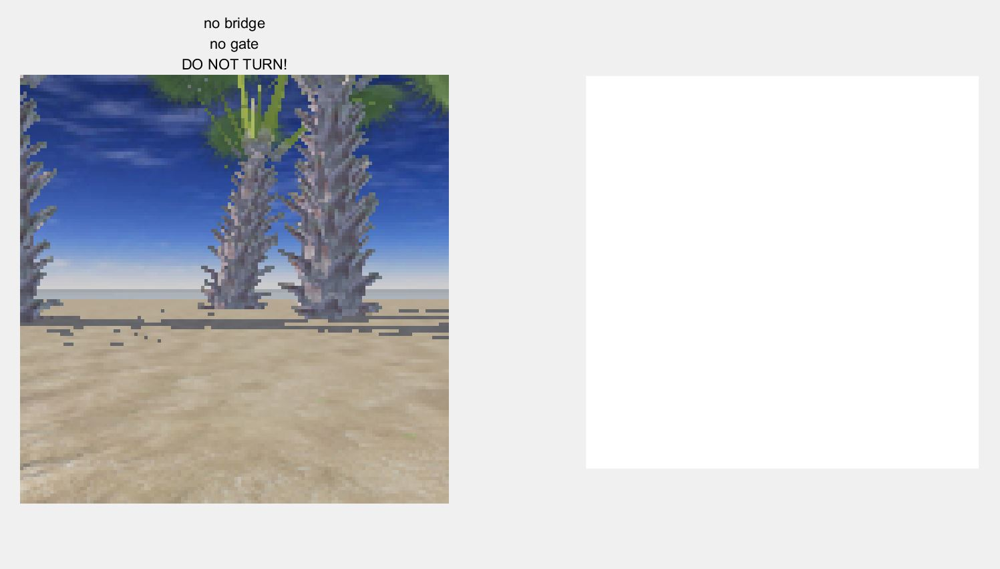

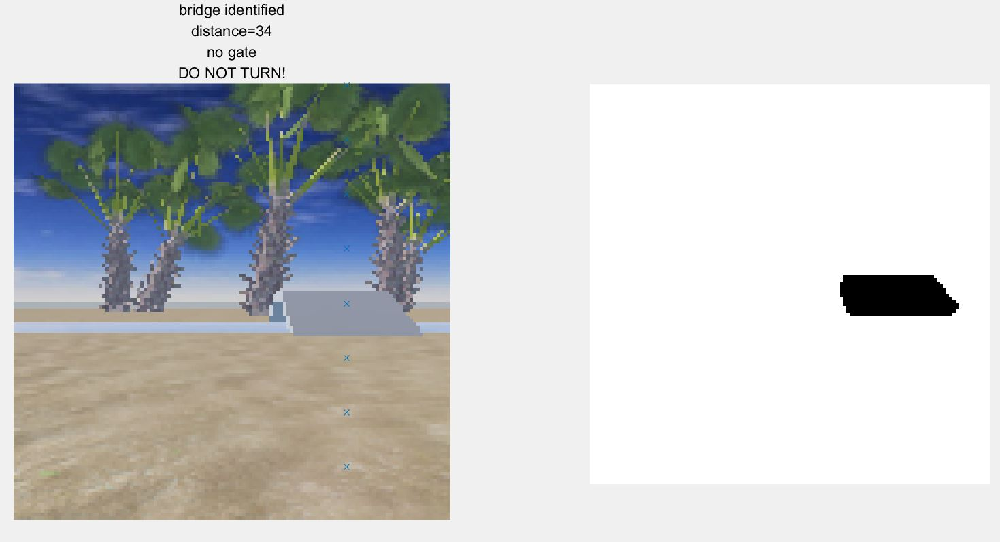

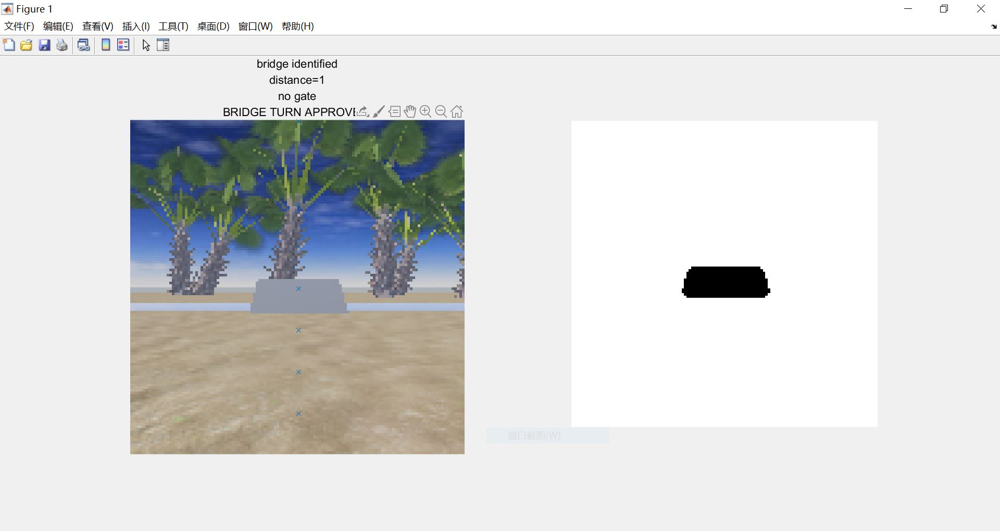

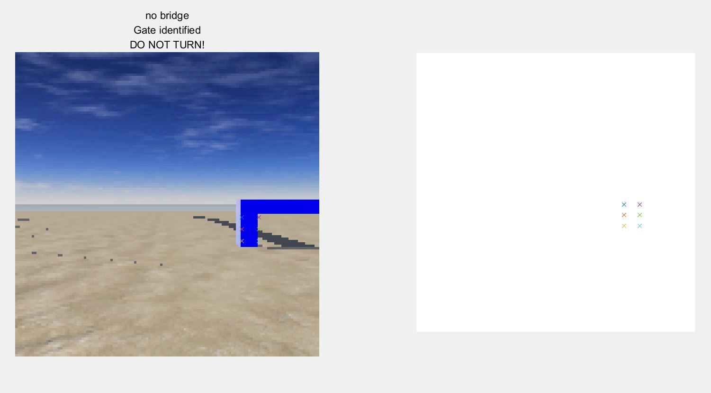

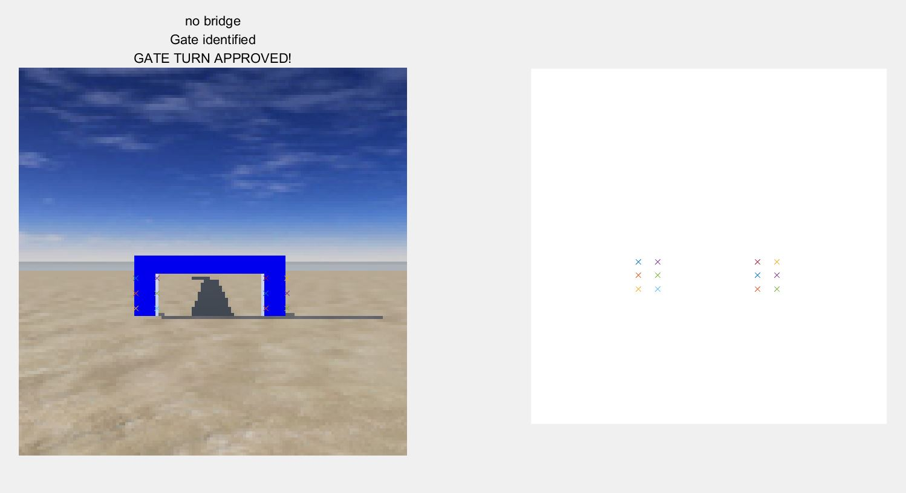

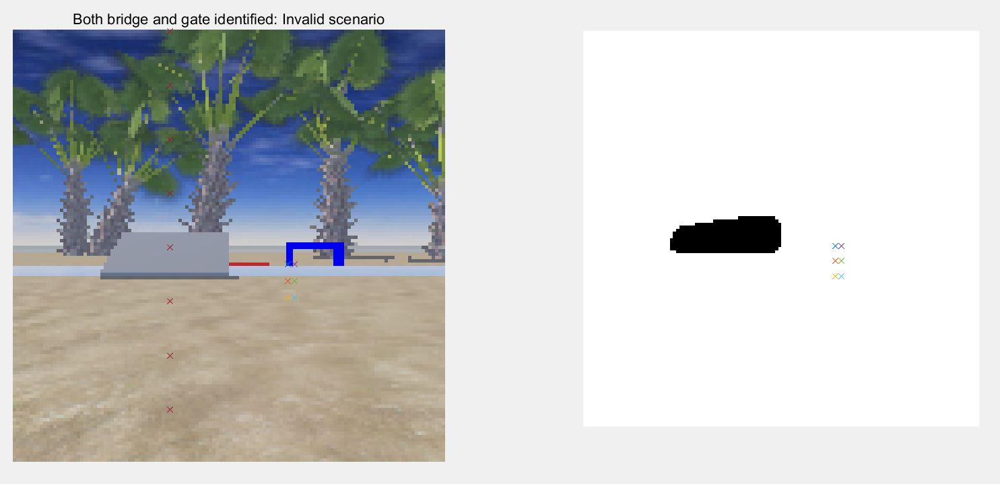


Conclusion

Finally an stable, functional and fast algorithm for bridge and gate detection is finished. Early test show that our homemade algorithm is much faster than exist algorithm for this task. It is very convenient to write experimental algorithm using MATLAB at the first place. Further conversion, implantation and optimization of this algorithm is handled to my teammate HAN Haoran.