### Table of Content

1. [Subject: <u>Study the difference of RGB and HSV</u>](#Subject-Study-the-difference-of-RGB-and-HSV)
2. [Subject: <u>Apply filters to smooth the image</u>](#Subject-Apply-filters-to-smooth-the-image)
3. [Subject: <u>Analyze the usage of LPF and Open Operation in HSV space</u>](#Subject-Analyze-the-usage-of-LPF-and-Open-Operation-in-HSV-space)
4. [Subject: <u>Fix the value range of each color in HSV space</u>](#subject-ufix-the-value-range-of-each-color-in-hsv-spaceu)
5. [Subject: <u>Use green block as the beacon</u>](#subject-uuse-green-block-as-the-beaconu)
6. [Subject: <u>Visualize task 5</u>](#visualize-task-5)

---

### Subject: Study the difference of RGB and HSV

#### Date: <u>April 7</u>   Author: <u>Chang Shu</u>

##### Purpose:
There are many color space, such as RGB, HSV, HSI, YCbCr, etc. They have different usage and we need to choose one for finishing our tasks. The most commonly used ones in digital image processing are RGB and HSV. So I just compare these two.

##### Procedure:
This experiment contains two parts:

1. search for the two color space online
2. Make a comparison between RGB and HSV color space

##### Results:


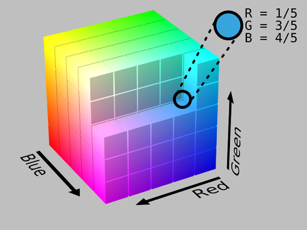

An RGB color can be understood by thinking of it as all possible colors that can be made from three colored lights for red, green, and blue. Imagine, for example, shining three lights together onto a white wall in a dark room: one red light, one green light, and one blue light, each with dimmers. If only the red light is on, the wall will be red. If only the green light is on, the wall will look green. If the red and green lights are on together, the wall will look yellow. Dim the red light and the wall will become more of a yellow-green. Dim the green light instead, and the wall will become more orange. Bringing up the blue light a bit will cause the orange to become less saturated and more whitish. In all, each setting of the three dimmers will produce a different result, either in color or in brightness or both. The set of all possible results is the gamut defined by those particular color lamps. Swap the red lamp for one of a different brand that is slightly more orange, and there will be a slightly different gamut, since the set of all colors that can be produced with the three lights will be changed.


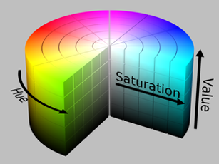

HSV (hue, saturation, value) is an alternative representation of the RGB color model. The HSV representation models the way paints of different colors mix together, with the saturation dimension resembling various tints of brightly colored paint, and the value dimension resembling the mixture of those paints with varying amounts of black or white paint.

Since we need to do the color recognition, HSV color space will be analyzed in our further experiment.

### Subject: Apply filters to smooth the image

#### Date: <u>May 1</u>   Author: <u>Chang Shu</u>

##### Purpose:

Smoothing is a key step in digital image processing. In practice, LPF is usually implemented to smooth the high frequency signal in the image, namely making the difference between two neighbor pixels smaller. This can make color recognition much easier.

##### Procedure:

This experiment contains two parts:

1. implement four different LPF on the image
2. plot the blurred images and compare them

##### Experiment:

The code is shown below.

```python
    image = cv2.imread(args['image'])
    blur = cv2.blur(image,(5,5))
    GaussianBlur = cv2.GaussianBlur(image, (5, 5), 0)
    median = cv2.medianBlur(image,5)
    bilateralFilter = cv2.bilateralFilter(image,9,75,75)

    plt.subplot(231),plt.imshow(image[...,::-1]),plt.title("original")
    plt.subplot(232),plt.imshow(blur[...,::-1]),plt.title("blurred")
    plt.subplot(233),plt.imshow(GaussianBlur[...,::-1]),plt.title("Gaussian blurred")
    plt.subplot(234),plt.imshow(median[...,::-1]),plt.title("median filtered")
    plt.subplot(235),plt.imshow(bilateralFilter[...,::-1]),plt.title("bilateral filtered")
    plt.show()
```

##### Results:

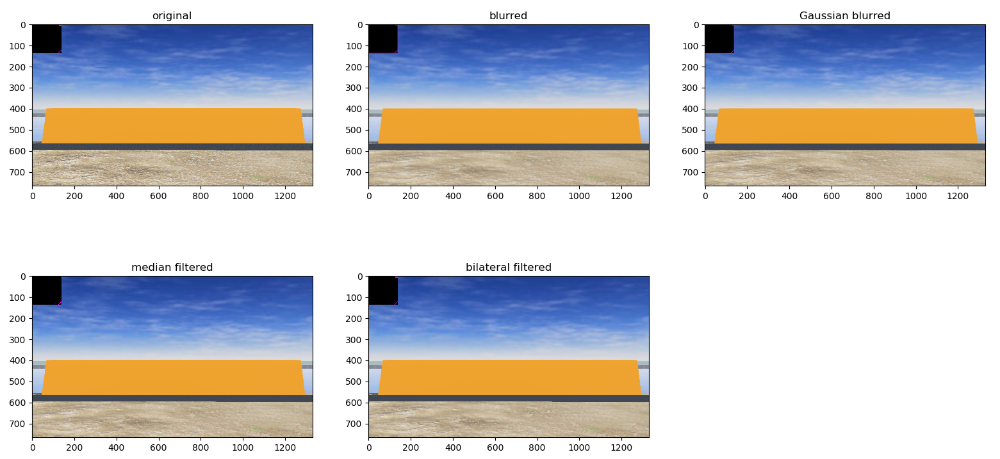

As we can see from above, four blurred images look smoother than original image. Among them, I choose the GaussianBlur as the filter in our following process.


### Subject: Analyze the usage of LPF and Open Operation in HSV space

#### Date: <u>May 13</u>   Author: <u>Chang Shu</u>

##### Purpose:

Last time, I study the usage of different filters in RGB color space, which smooths the image quite a lot. However, our target is to remove the noise in the interested color not in the whole image. Smoothing the whole image may even makes it worse to recognize and filter the color. Hence, I do an experiment to see the effect of LPF in removing noise HSV color space and compare it with the opening operation.

##### Procedure:

This experiment contains two parts:

1. implement Gaussian blur and opening operation on the image in HSV space
2. plot the binary HSV images and compare them

##### Experiment:

The code is shown below.

```python
    image = cv2.imread(args['image'])
    image_hsv = cv2.cvtColor(image, cv2.COLOR_BGR2HSV)
    GaussianBlur = cv2.GaussianBlur(image_hsv, (9, 9), 0)

    kernel = np.ones([7, 7], np.uint8)
    binary_hsv = cv2.inRange(image_hsv, (24, 70, 0), (32, 255, 180))
    binary_Gaussian = cv2.inRange(GaussianBlur, (24, 70, 0), (32, 255, 180))

    binary_erode = cv2.erode(binary_hsv, kernel, iterations=1)
    binary_open = cv2.dilate(binary_erode, kernel, iterations=1)

    binary_Gaussian_erode = cv2.erode(binary_Gaussian, kernel, iterations=1)
    binary_Gaussian_open = cv2.dilate(binary_Gaussian_erode, kernel, iterations=1)

    plt.subplot(151),plt.imshow(image_hsv),plt.title("original image in HSV")
    plt.subplot(152),plt.imshow(binary_hsv),plt.title("thresholding without LPF and Opening")
    plt.subplot(153),plt.imshow(binary_Gaussian),plt.title("thresholding with LPF")
    plt.subplot(154),plt.imshow(binary_open),plt.title("thresholding with Opening")
    plt.subplot(155),plt.imshow(binary_Gaussian_open),plt.title("thresholding with LPF and Opening")
    plt.show()
```

##### Results:

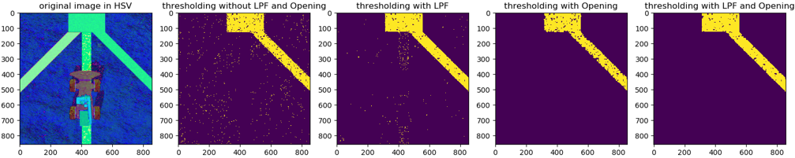
In the figure above, I add random noise to the image and the Gaussian blur reduce the noise to a large extent. However, opening operation seems to work better than the Gaussian blur. So I add even more noise to the images to see if this situation still holds true. If it is, then there is no need to implement LPF in the image processing part.

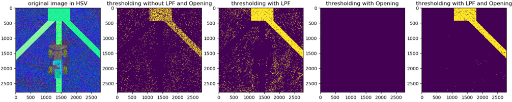
As is shown in the second image, the LPF does not remove the noise, but brings about more noise. The reason is the Gaussian filter actually work on the whole image instead of our interested color. It can make pixels original not in the range of the color we want inside.

However, this doesn't mean the LPF is unnecessary when we look at the image processed by opening operation. As we can see, all the image is eroded as the original image suffers from a high level of discontinuity due to the noise. And with a combination of LPF and opening operation, the road is preserved.


### Subject: <u>Fix the value range of each color in HSV space</u>

#### Date: <u>May 18</u>   Author: <u>Chang Shu</u>

##### Purpose:

In our project, we need to recognize several colors, including orange, yellow, red, purple. In digital image processing, common practice has it that difference colors are separated in HSV color space. In order to separate different colors by their value ranges, I conduct the following experiment.

##### Procedure:

This experiment contains two parts:

1. Plot the histogram of each color in HSV color space to obtain a rough range
2. fine-tune this range on images from the webots camera with GUI

##### Experiment:

The code is shown below.

```python
#!/usr/bin/env python
# -*- coding: utf-8 -*-

# USAGE: You need to specify a filter
#
# (python) color_thresholding --filter RGB --image /path/to/image.png
# or
# (python) color_thresholding --filter HSV --image /path/to/image.png

import argparse

import cv2
import numpy as np
from matplotlib import pyplot as plt


def callback(value):
    pass


def setup_trackbars(range_filter):
    cv2.namedWindow("Trackbars", 0)

    for i in ["MIN", "MAX"]:
        v = 0 if i == "MIN" else 255

        for j in range_filter:
            cv2.createTrackbar("%s_%s" % (j, i), "Trackbars", v, 255, callback)


def get_arguments():
    ap = argparse.ArgumentParser()
    ap.add_argument('-f', '--filter', required=True,
                    help='Range filter. RGB or HSV')
    ap.add_argument('-i', '--image', required=False,
                    help='Path to the image')
    ap.add_argument('-p', '--preview', required=False,
                    help='Show a preview of the image after applying the mask',
                    action='store_true')
    args = vars(ap.parse_args())

    if not bool(args['image']):
        ap.error("Please specify only one image source")

    if not args['filter'].upper() in ['RGB', 'HSV']:
        ap.error("Please specify a correct filter.")

    return args

def get_trackbar_values(range_filter):
    values = []

    for i in ["MIN", "MAX"]:
        for j in range_filter:
            v = cv2.getTrackbarPos("%s_%s" % (j, i), "Trackbars")
            values.append(v)

    return values

def main():
    args = get_arguments()

    range_filter = args['filter'].upper()

    # Compare different filters
    image = cv2.imread(args['image'])
    # blur = cv2.blur(image,(5,5))
    GaussianBlur = cv2.GaussianBlur(image, (5, 5), 0)
    # median = cv2.medianBlur(image,5)
    # bilateralFilter = cv2.bilateralFilter(image,9,75,75)

    # plt.subplot(231),plt.imshow(image[...,::-1]),plt.title("original")
    # plt.subplot(232),plt.imshow(blur[...,::-1]),plt.title("blurred")
    # plt.subplot(233),plt.imshow(GaussianBlur[...,::-1]),plt.title("Gaussian blurred")
    # plt.subplot(234),plt.imshow(median[...,::-1]),plt.title("median filtered")
    # plt.subplot(235),plt.imshow(bilateralFilter[...,::-1]),plt.title("bilateral filtered")
    # plt.show()


    # Plot Histogram in HSV Color Space
    blur = cv2.cvtColor(GaussianBlur,cv2.COLOR_BGR2HSV)
    # Plot HSV Histgram
    fig, ax = plt.subplots()
    hsvColor = ('y','g','k')
    bin_win = 3
    bin_num = int(256/bin_win)
    xticks_win = 2

    ax.set_title('HSV Color Space')
    lines = []

    for cidx, color in enumerate(hsvColor):
        cHist = cv2.calcHist([blur], [cidx], None, [bin_num], [0,255])
        line = ax.plot(cHist, color=color, linewidth=8)
        lines.append(line)

    labels = [cname + ' Channel' for cname in 'HSV']

    plt.legend(lines, labels, loc='upper right')
    ax.set_xlim([0, bin_num])
    ax.set_xticks(np.arange(0, bin_num, xticks_win))
    ax.set_xticklabels(list(range(0, 256, bin_win*xticks_win)),rotation=45)
    plt.show()


    # Start thresholding
    if range_filter == 'RGB':
        frame_to_thresh = GaussianBlur.copy()
    else:
        frame_to_thresh = cv2.cvtColor(GaussianBlur, cv2.COLOR_BGR2HSV)

    setup_trackbars(range_filter)

    while True:

        v1_min, v2_min, v3_min, v1_max, v2_max, v3_max = get_trackbar_values(
            range_filter)

        thresh = cv2.inRange(
            frame_to_thresh, (v1_min, v2_min, v3_min), (v1_max, v2_max, v3_max))
        thresh = cv2.threshold(thresh, 127, 255, cv2.THRESH_BINARY_INV)[1]

        if args['preview']:
            preview = cv2.bitwise_and(image, image, mask=thresh)
            cv2.imshow("Preview", preview)
        else:
            cv2.imshow("Original", image)
            cv2.imshow("Thresh", thresh)

        if cv2.waitKey(1) & 0xFF is ord('q'):
            break

if __name__ == '__main__':
    main()
```

The histogram of different colors are obtained using Python and plotted as follows. Then I use the Python GUI to fine-tune the range on images from webots.

###### Orange:

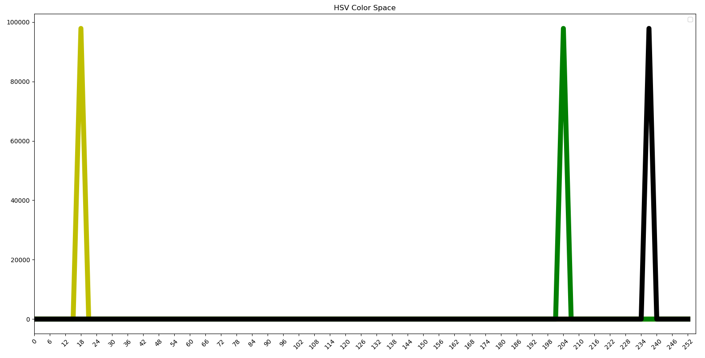

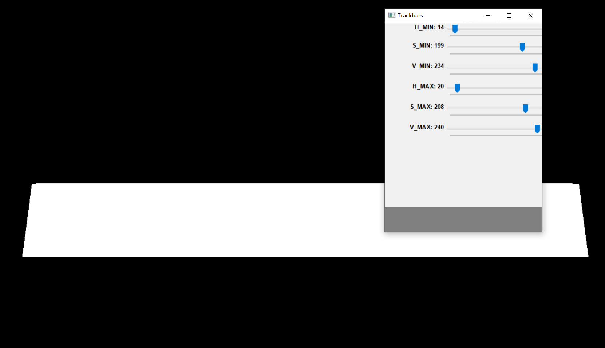


As is shown above, orange is preserved in white while other colors are filtered with the thresholds in the trackbars.

###### Yellow:

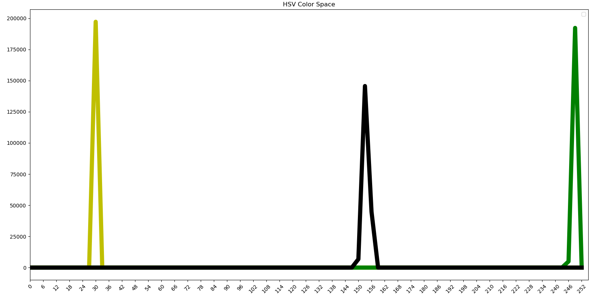

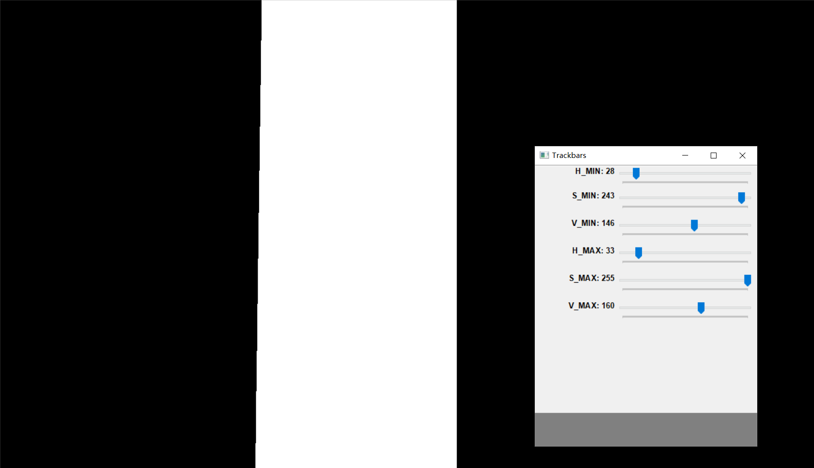

As is shown above, yellow is preserved in white while other colors are filtered with the thresholds in the trackbars.

###### Red:

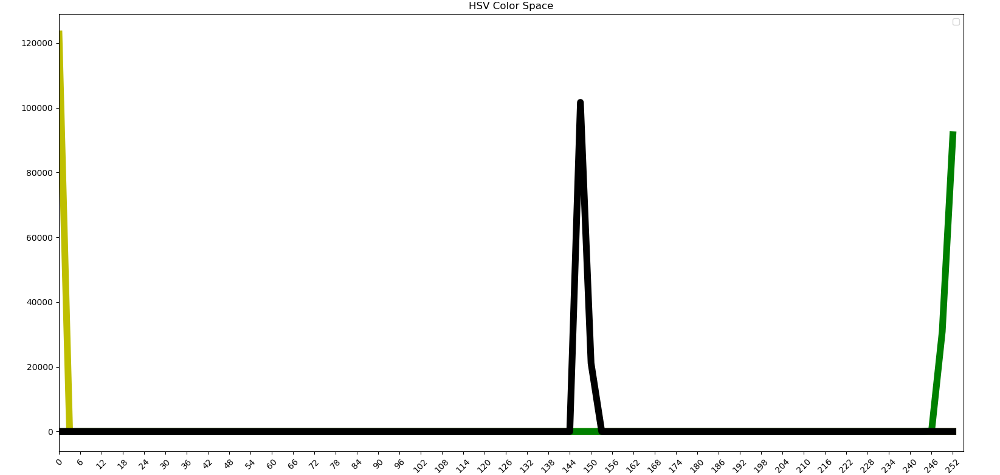

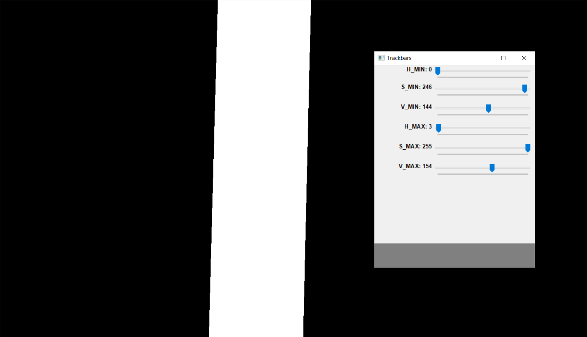

As is shown above, red is preserved in white while other colors are filtered with the thresholds in the trackbars.

###### Purple:

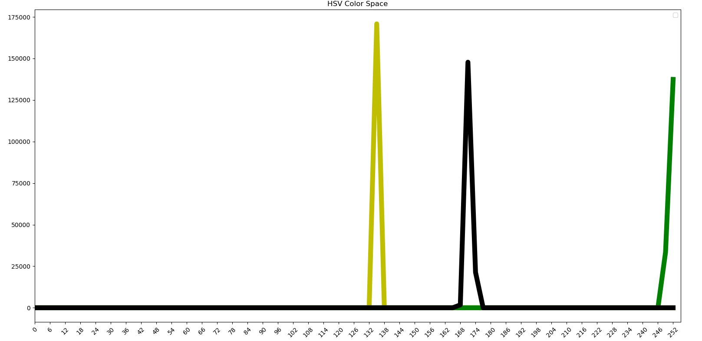

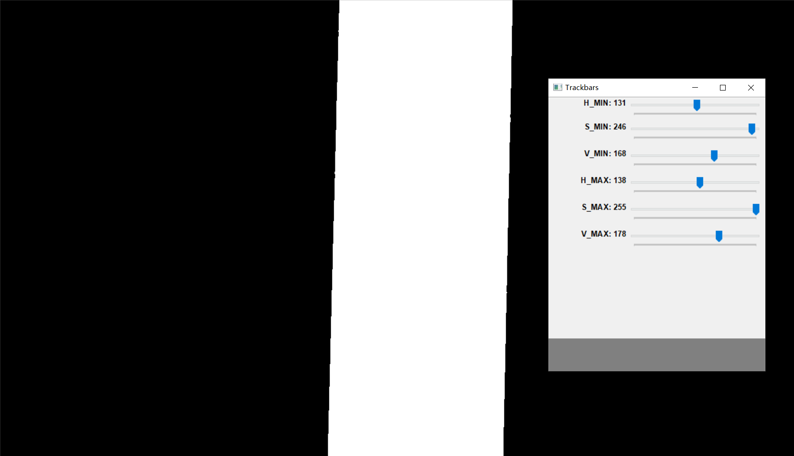

As is shown above, purple is preserved in white while other colors are filtered with the thresholds in the trackbars.

##### Results:

 Finally, we can obtain a color value range table as follows.

| color  | [Hmin, hmax]           | [Hmin, Smax]           | [Vmin, Vmax]           |
| ------ | ---------------------- | ---------------------- | ---------------------- |
| orange | [14, 21]               | [199, 208]             | [234, 240]             |
| red    | [0, 3]                 | [246, 255]             | [144, 154]             |
| purple | [132, 138]             | [246, 255]             | [168, 178]             |
| yellow | [27, 33]               | [243,252]              | [146, 160]             |


### Subject: <u>Use green block as the beacon</u>

#### Date: <u>May 25</u>   Author: <u>Chang Shu</u>

##### Purpose:

Since we are allowed to use 2 beacons in the project, I choose the green block as the beacon. Then we transform the beacon detection problem into a color detection problem.

##### Procedure:

1. place a green block on targeted place
2. find its histogram in HSV space
3. use Python GUI to fine-tune the range value

##### Experiment:

Here, we place a green block on the left side of the bridge.

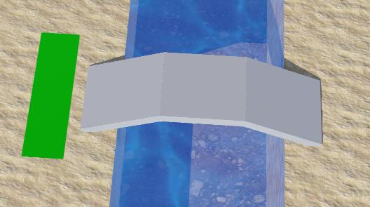

The histogram of green is shown below.

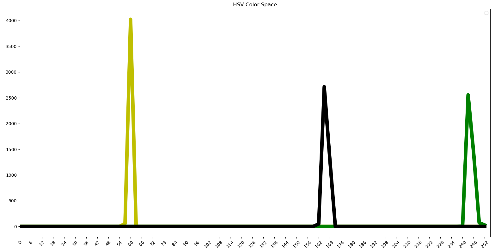

Then I use the GUI to find the range value.

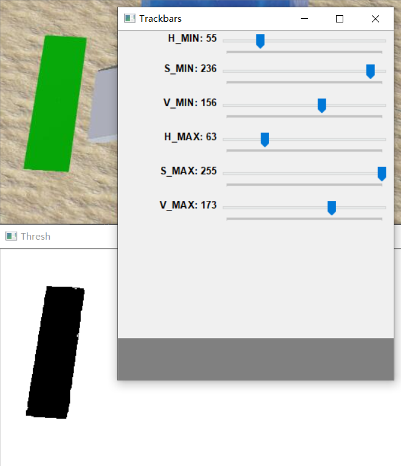

##### Results:

Finally, I obtain the range value of green in HSV space as follows.

| color | [Hmin, hmax]           | [Hmin, Smax]           | [Vmin, Vmax]           |
| ----- | ---------------------- | ---------------------- | ---------------------- |
| green | [55, 63]               | [236, 255]             | [156, 173]             |

### Visualize task 5

#### Date: <u>June 1</u>   Author: <u>Chang Shu</u>

##### Purpose:

The output of color filtering is task 5 can be visualized so that our professors can better understand it principle.

##### Procedure:

This experiment is done in two steps:
1. Add the ROI(Region of Interest) using green box and red dot.
2. Add a semi-transparent mask to indict the path the rover actually follows

##### Experiment:

The code is shown below.

```python
if self.path_color is None:
    # get rectangle of road in roi
    cv2.rectangle(image_show, (0, foresight_up), (image_show.shape[1], foresight_down), (0, 255, 0))
    # get center of road in roi
    f_y, f_x = np.mean(a=location, axis=0)
    cv2.circle(image_show, (int(f_x), foresight_up + int(f_y)), 1, (0, 0, 255), 0)
    cv2.imshow('path_detection', image_show)
else:
    # add semi-transparent mask of the filtered path
    mask = cv2.cvtColor(image_gray, cv2.COLOR_GRAY2BGR)
    alpha = 0.7
    beta = 1 - alpha
    gamma = 0
    image_mask = cv2.addWeighted(image_show, alpha, mask, beta, gamma)
    # get rectangle of road in roi
    cv2.rectangle(image_mask, (0, foresight_up), (image_show.shape[1], foresight_down), (0, 255, 0))
    # get center of road in roi
    f_y, f_x = np.mean(a=location, axis=0)
    cv2.circle(image_mask, (int(f_x), foresight_up + int(f_y)), 1, (0, 0, 255), 0)
    cv2.imshow('path_detection', image_mask)
```

##### Results:
The processed images are shown as follows.

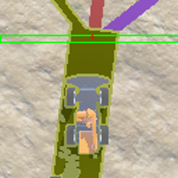


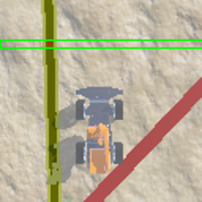

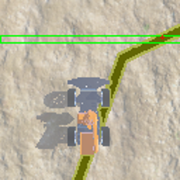

