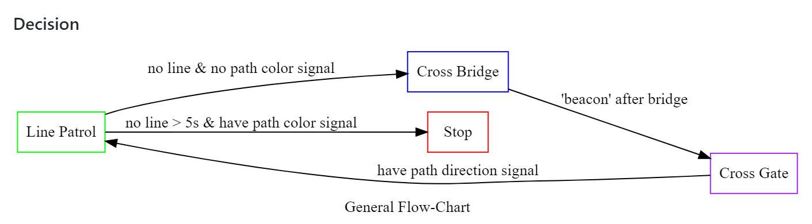
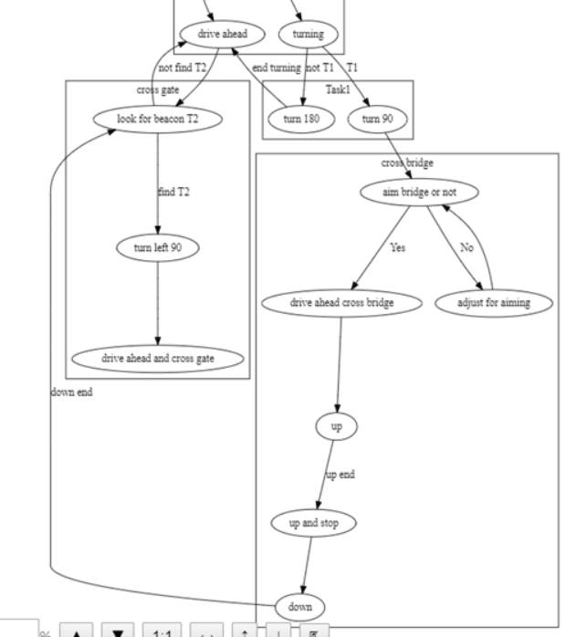
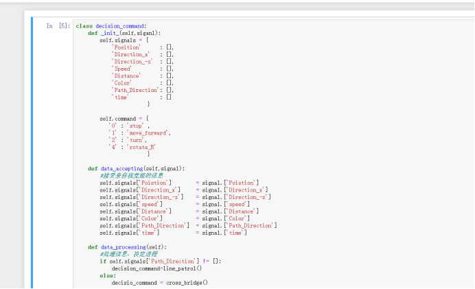
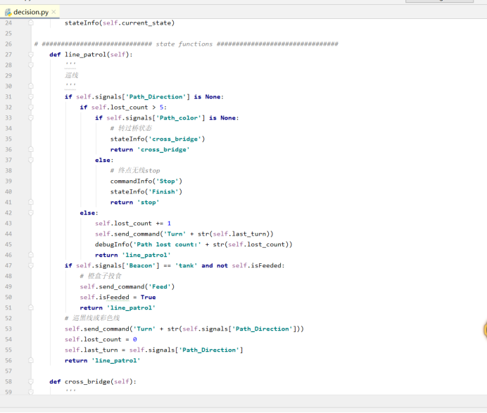
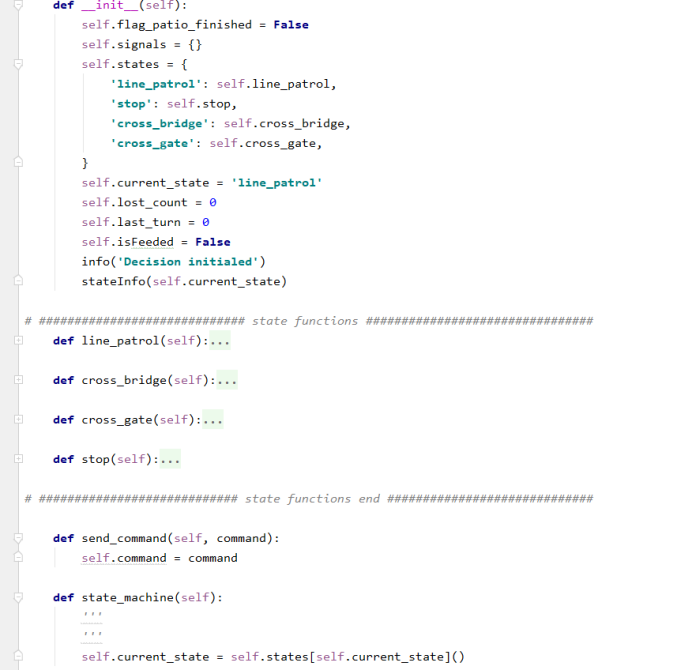

### Subject: decision flow chart and decision code

#### Date: <u>April 18</u>   Author: <u>Hanpeng Xu</u>

##### Purpose: 

We have known the whole tasks of this project and the map has been made. So our assignment is to make a general flow chart and discuss about operation details of the patrol car with other technical group. (for example , when the patrol car comes to the front of bridge ,What information does the car rely on to stop and turn in what way).

##### Solution:

The handwritten chart is the general flow chart , but we still need fill in more details.

Besides, we had meeting with vision group and chassis group to discuss about what information the car need and how to realize the car turning.

### Subject: decision flow chart details

#### Date: <u>May 7</u>   Author: <u>Hanpeng Xu</u>

##### Purpose: 

After regular meeting , technical groups confirm many technical details (like :The car can turn on the spot and the camera can see the bridge).our decision group work is to put the detail in the flow chart and consider how to accomplish the task by combining the action commands of the chassis group in a simple way.

##### Solution:
after meeting , we took a notebook of the meeting and made a brief diagram. But there was a lot we don't understand,such as: if the camera doesn't catch the bridge , how should the patrol car reflect. So ,We found a video that our upperclassmen made last semester when they were completing their assignments.

### Subject: converting the flow chart into python code

#### Date: <u>May 21</u>   Author: <u>Hanpeng Xu</u>

##### Purpose: 

At last week , we have complete the design of flow chart .at this week regular meeting , our team discussed about the diagram and decided to start the test. So , our work is to convert the flow chart into python code.when writing codes , we met difficulties. For example , What code structure is used to execute the command, and what is the overall framework of the code.

##### Solution:
First of all, we go to the Github community and see what framework someone else's car code is using. Then we run a rough draft in jupyter notebook, trying out different frames.

After a lot of debugging, we decide to use a state machine frame.

## Subject: Final commissioning

#### Date: <u>May 31</u>   Author: <u>Hanpeng Xu</u>

##### Purpose: 

After the decision group code is completed, the trolley will be finally debugged.

##### Solution: