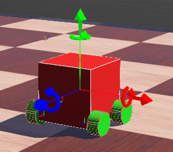
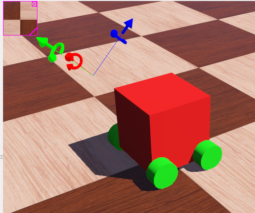

## Subject: Webots sensors application

### Date:  Apr 16   Author: <u>Haoran Han</u>

#### Purpose: 

To figure out the usage of webot sensor that may be used in project later. This notebook will last for several days and it will be continuously expanded.

1. #### The Basic operation of the Webot object:

- For any object, it is invisible originally. Only if we add a **"shape"** property to the children part, could the object become visible to us.

- If the object need to interact with the environment (like a wheel), we need to modify the **"bnoumdingObject"** part of the robot. The bounding and the visible shape of the object does not need to be the same.

- As shown below, the position and the direction is characterised by three line shown as below: **red, green, and blue** arrow represents the **x, y, z** axis respectively. By modifying the **"translation"** and **"rotation"** property of the object, the position and the direction could be changed.

   
  

- For a default type of distance sensor, the maximum distance that it could detect is 10cm, which is far from enough. By modifying **"lookup Table"** property, we could change the maximum distance it could detect. `[x y z]` represent the maximum distance, the maximum return value and the standard of noise respective.

2. #### Usage of the distance sensor:

- Firstly, add the **"disatncesensor"** to the children part of the robot.

- By modifying the **"translation"** and **"rotation"** property, we could change the relative position between the robot and the sensor. By modifying **"rotation"** property, we could change the direction towards which the sensor detect. 

- Noticing that, the sensor always detect along the **_positive direction of the x-axis_**.

- Changing the **"name"** property of the sensor, and this will be the name that we will use in the ### python code. 

- The typical Python code that calls the distance sensor:
```
ds = []
dsNames = ['ds_right', 'ds_left']
for i in range(2):
    ds.append(robot.getDistanceSensor(dsNames[i]))
    ds[i].enable(TIME_STEP)
...
if ds[0].getValue() > 950.0:
...
```
where `robot.getDistanceSensor(dsNames[i])` will call the sensor and `ds[0].getValue()` will give the distance that the sensor detect.

- The range of the sensor could reach is 10cm. when the distance it detects is equal or above 10cm, `.getValue()` will return a float of 1000.0

3. #### Basic usage of camera:

- Firstly, add the **"camera"** to the children part of the robot.

- The modifying process of the position and the direction is the same shown in above section.

- The direction that the camera towards is the **negtive direction along the z-axis** (opposite to the blue arrow).

- the upper part of the camera is along the **positive dirction along the y-axis (towards the green arrow). The position of the camera that I select:


- The typical Python code that calls the camera:
```
from controller import Robot,Camera
...
camera=Camera("test")
camera.enable(1)
...
image = camera.getImageArray()
```

- We need to import the `Camera` package. and  `camera=Camera("camera")`  calls the camera with a name property of "test". 
- Only after being `.enable(x)`, could the camera start to work. where `x` means the camera will use `x`ms to take a picture.
- By using `.getImageArray()`, we could get a **"list"** the represent the last picture that the camera get. The channel is **RGB**.
- By applying the **"Height"** and **"Weight"** property. we could get picture with different pixels 


4. #### Usage of the Opencv package in the Webot:

- Firstly, simply import the package
```
import numpy as np
import cv2
```

- Applying `.getImageArray()`, we could get a list that represent the picture.

- By applying the next several lines of code, the picture could be process by the build in function of opencv
```
image = np.array(camera.getImageArray(),dtype="uint8")
r,g,b=cv2.split(image)
image=cv2.merge((b,g,r))
```

- The default type of the picture get by the Webot camera is `int32`, which could not be processed by the opencv. In that case, we need to set `dtype="uint8"` so that the opencv could process without error.

- The channel need to be changed.


### Date:  Apr 28   Author: <u>Haoran Han</u>

#### Usage of the Compass Sensor:

- Add a compass as the children of the robot. Change it name to what you want or the default "compass"

- in the conntroller.py code:
```
from controller import Compass
Compass1=Compass("compass")
Compass1.enable(1)
print(Compass1.getValues())
```
could directly return a list with shape=[3], dtype=float64. The return shows the dirction where the z-axis points to.


### Date:  Apr 30   Author: <u>Haoran Han</u>

1. #### Usage of the Accelerometer Sensor:

- Add a Accelerometer as the children of the robot. Change it name to what you want or the default "accelerometer"

- in the conntroller.py code:

```
from controller import Accelerometer
Accelerometer1=Accelerometer("accelerometer")
Accelerometer1.enable(1)
print(Accelerometer1.getValues())
```
could dirctly return a list with shape=[3], dtype=float64. The return shows the acceleration along each axis.

- The return of **y-axis** is  the real acceleration with a gravity, g, added

2. #### Usage of the GPS Sensor:

- Add a GPS as the children of the robot. Change it name to what you want or the default "gps"

- In the conntroller.py code:
```
from controller import GPS
GPS1=GPS("gps")
GPS1.enable(1)
print(GPS1.getValues())
```

- could dirctly return a list with shape=[3], dtype=float64. The return shows the absolute position of the sensor along each axis.