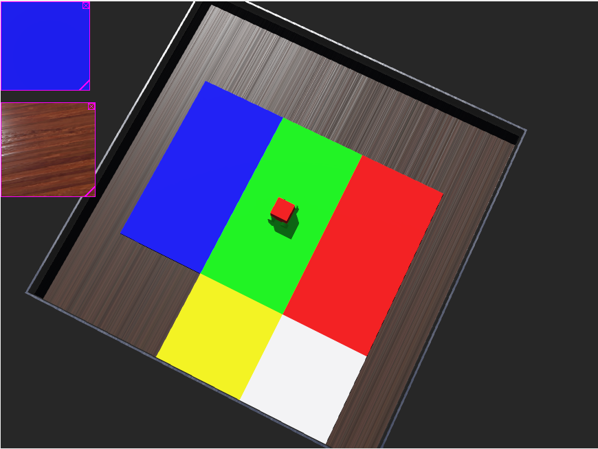

## Subject: Webots visual sensors application

### Date:  Apr 23   Author: <u>Haoran Han</u>

#### Purpose: 

To figure out the how to filter the color through RGB domain.

#### Experiment：

The color recognition is already been accomplished. Even though Song and Shu has discussed above HSV, through simulation, I find the RGB channel is sufficient to finish the task. I have told Chu how to modify the environment:

- Change the color of the Bridge to white

- Transform the background to single color

The platform where I run my simulation is as follows:

By adding another camera at the head of the robot, we could use it as a color sensor. The color distribution on RGB channel that I have capture is as follows:    
red: 234     30        32
green: 29       234      32
blue: 30       30        237
yellow: 234     234      32
white: 234     234      237     
ground: 65, 58, 52

In that case, only by counting the channel that exceed 200, we could recognize the color. The code is as follows:
```Python
def get_Color():
    image = np.array(Color.getImageArray(),dtype="uint8")
    r,g,b=cv2.split(image)
    r=r[48:79,48:79].mean()
    if r>200:
        r=True
    else: r=False
    
    g=g[48:79,48:79].mean()
    if g>200:
        g=True
    else: g=False

    
    b=b[48:79,48:79].mean()
    if b>200:
        b=True
    else: b=False
    
    color="None"
    if r:
        if g:
            if b:
                color="white"
            else: color="yellow"
        else: color="red"
    elif g: color="green"
    elif b: color="blue"
    else: color="background"
    
    return color
```