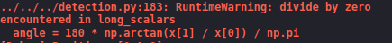

## Subject: Convert to angle

### Date:  May 23   Author: <u>Haoran Han</u>

#### Purpose: 

Since the direction that get by the **compass** is in the `[x, y, z]` form, we need to change it to the angle part.  

#### Experiment：

```Python
def tri2angle(self, opposite, adjacent):
        '''
        return an angle (in degrees) based on the given opposite edge and adjacent edge 		of a triangle, in range of (-180, 180]\n
        `opposite`: opposite edge of the angle\n
        `adjacent`: adjacent edge of the angle\n
        '''
        if adjacent == 0.0:
            angle = np.sign(opposite) * 90
        else:
            angle = 180 * np.arctan(opposite / adjacent) / np.pi
            if adjacent < 0:
                if opposite > 0:
                    angle = angle + 180
                else:
                    angle = angle - 180
        return angle
```

Remember, if we do not consider the `zero situation`, there may be some error occurs in the process.



