### Table of Content

1. [tutorial car (2020/4/14)](#tutorial-car-2020414)
2. [simple version of feeder(2020/4/20)](#simple-version-of-feeder2020420)
3. [chassis model importing (2020/4/24)](#chassis-model-importing-2020424)
4. [assembling with imported model (2020/4/30)](#assembling-with-imported-model-2020430)
5. ['boundingobject' problem solved(2020/5/1)](#boundingobject-problem-solved202051)
6. [improved feeder(2020/5/14)](#improved-feeder2020514)
7. [update chassis.py(2020/5/15)](#update-chassispy2020515)
8. [chassis test controller(2020/5/16)](#chassis-test-controller2020516)
9. [turning algorithm(2020/5/20)](#turning-algorithm2020520)
10. [update chassis.py(2020/5/23)](#update-chassispy2020523)
11. [improved feeder(2020/5/24)](#improved-feeder2020524)
12. [update chassis.py(2020/5/26)](#update-chassispy2020526)

---

## Differential steering chassis

### tutorial car (2020/4/14)

#### description:

- construction based on tutorial
- go straight
- detect obstacle and turn to avoid collision

#### structure:

- Robot
  - children
    - DistanceSensor "ds_left"
    - DistanceSensor "ds_right"
    - HingeJoint
    - HingeJoint
    - HingeJoint
    - HingeJoint
    - DEF Body Shape

#### specification:

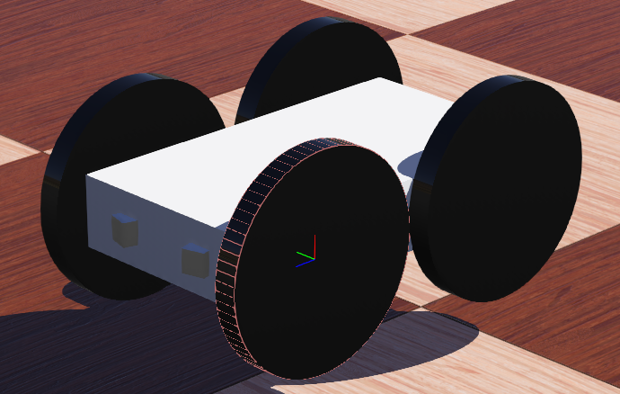

| part  | size                       | unit |
| ----- | -------------------------- | ---- |
| wheel | radius: 0.045, width: 0.01 | m    |
| body  | 0.09\*0.03\*0.16           | m    |


#### codes:

```c++
#include <webots/DistanceSensor.hpp>
#include <webots/Motor.hpp>
#include <webots/Robot.hpp>

#define TIME_STEP 64
using namespace webots;

int main(int argc, char **argv) {
  Robot *robot = new Robot();
  DistanceSensor *ds[2];
  char dsNames[2][10] = {"ds_right", "ds_left"};
  for (int i = 0; i < 2; i++) {
    ds[i] = robot->getDistanceSensor(dsNames[i]);
    ds[i]->enable(TIME_STEP);
  }
  Motor *wheels[4];
  char wheels_names[4][8] = {"wheel1", "wheel2", "wheel3", "wheel4"};
  for (int i = 0; i < 4; i++) {
    wheels[i] = robot->getMotor(wheels_names[i]);
    wheels[i]->setPosition(INFINITY);             
    wheels[i]->setVelocity(0.0);
  }
  int avoidObstacleCounter = 0;
  while (robot->step(TIME_STEP) != -1) {
    double leftSpeed = 1.0;
    double rightSpeed = 1.0;
    printf("avoidObstacleCounter = %d\n",avoidObstacleCounter);
    if (avoidObstacleCounter > 0) {
      avoidObstacleCounter--;
      leftSpeed = 1.0;
      rightSpeed = -1.0;
    } else { // read sensors
      for (int i = 0; i < 2; i++) {
        if (ds[i]->getValue() < 950.0)
          avoidObstacleCounter = 10;
      }
    }
    wheels[0]->setVelocity(leftSpeed);
    wheels[1]->setVelocity(rightSpeed);
    wheels[2]->setVelocity(rightSpeed);
    wheels[3]->setVelocity(leftSpeed);
  }
  delete robot;
  return 0;  // EXIT_SUCCESS
}
```

### simple version of feeder(2020/4/20)

#### description:

- a rotating plate to through fish food

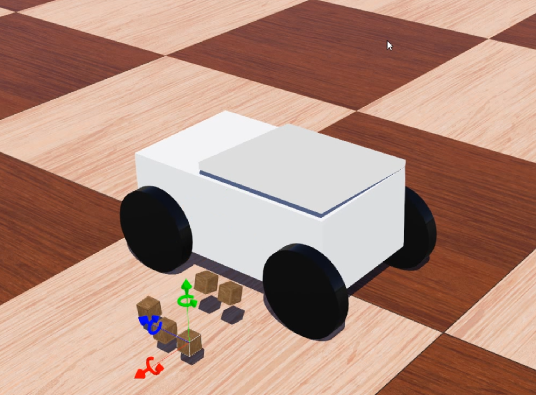

### chassis model importing (2020/4/24)

#### description:

- editing model with solid works

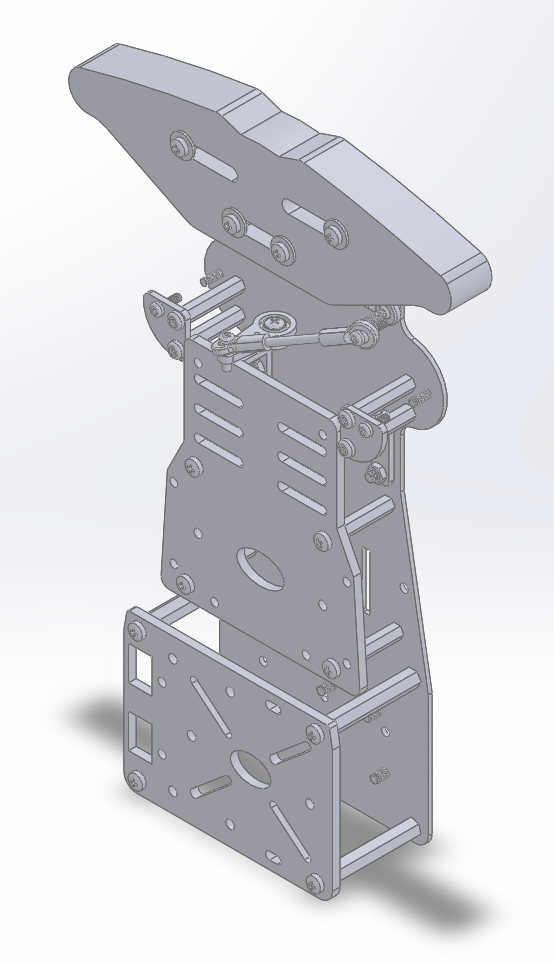

- importing errors occur

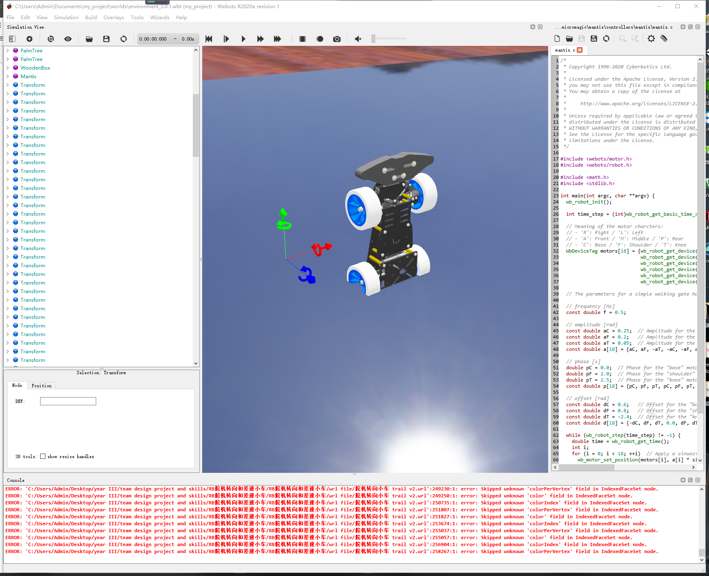

- imported wheel centered at wrong position

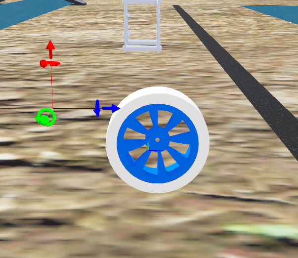

- setting wheel center point

http://help.solidworks.com/2016/Chinese-simplified/SolidWorks/Sldworks/t_Changing_the_Origin_Location_and_Orientation.htm

http://blog.sina.com.cn/s/blog_7e5989aa0100rzoa.html

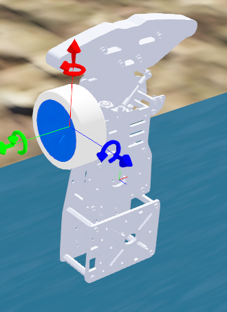


### assembling with imported model (2020/4/30)

#### description:

- fail to to set the imported model as 'boundingobject', webots crush
- try to export simplified model from solid works

http://help.solidworks.com/2017/chinese-simplified/SolidWorks/sldworks/t_simplifying_parts.htm

http://help.solidworks.com/2017/chinese-simplified/SolidWorks/scanto3d/t_simplifying_mesh_or_point_cloud_files.htm

### 'boundingobject' problem solved(2020/5/1)

#### description:

- set a box including the model as 'boundingobject'

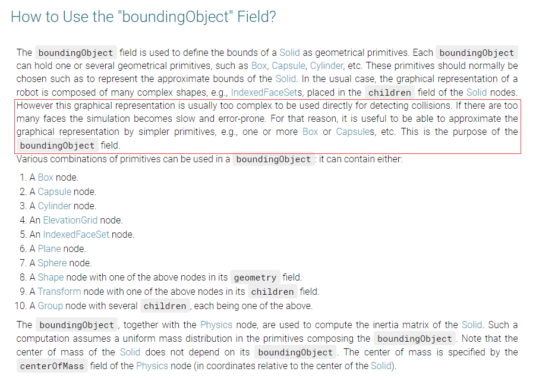

### improved feeder(2020/5/14)

#### description:

- a new feeder: a rotating box

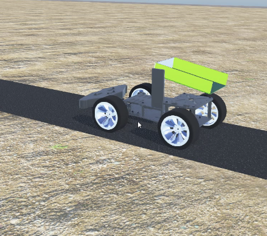

- turning problem: after new feeder added, the car cannot turn around its geometry center.
  - possible explanation one: different friction of different surfaces
  - possible explanation two: feeder changes the mass center of the chassis

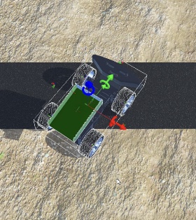

### update chassis.py(2020/5/15) 

#### description:

- define basic command(moving forward, moving backward, turn right, turn left)

#### codes:

```python
import time

from colored import commandInfo, debugInfo, detectedInfo, info


class Motor(object):
    '''
    motor interface
    '''
    def __init__(self, robot):
        timestep = int(robot.getBasicTimeStep())

        # enable motors
        self.motors = {}
        self.motors['arm'] = robot.getMotor('arm')
        # wheel
        self.motors['wheel1'] = robot.getMotor('wheel1')
        self.motors['wheel2'] = robot.getMotor('wheel2')
        self.motors['wheel3'] = robot.getMotor('wheel3')
        self.motors['wheel3'] = robot.getMotor('wheel3')
        # wheel
        for motor in self.motors:
            self.motors[motor].setPosition(float('inf'))
            self.motors[motor].setVelocity(0.0)

    def update(self, velocityDict):
        '''
        `velocityList`: list of velocity to set to motors
        '''
        for motor in velocityDict:
            self.motors[motor].setVelocity(velocityDict[motor])

# WHERRERER SO MY 
class Controller(object):
    '''
    Controller class
    '''
    def __init__(self):
        self.velocityDict = {}
        info('Chassis initialed')

    def set_queue(self, command_queue, motors_queue):
        self.command_queue = command_queue
        self.motors_queue = motors_queue

    def recv_command(self):
        '''
        return the received command from command_queue\n
        the return value will be `''` if command_queue is empty
        '''
        if not self.command_queue.empty():
            return self.command_queue.get()
        else:
            return ''

    def set_state(self, command):
        '''
        set state of the chassis by command, a commandInfo will output
        '''
        # clean state
        for motor in self.velocityDict:
            self.velocityDict[motor] = 0

        if command:
            if command == 'Rotate arm':
                self.state = 'Arm rotating'
                self.velocityDict['arm'] = 10
            # wheel
            if command == 'Move forward':
                self.state = 'Moving forward'
                self.velocityDict['wheel1'] = -10
                self.velocityDict['wheel2'] = -10
                self.velocityDict['wheel3'] = -10
                self.velocityDict['wheel4'] = -10
            
            if command == 'Move backward':
                self.state = 'Moving backward'
                self.velocityDict['wheel1'] = 10
                self.velocityDict['wheel2'] = 10
                self.velocityDict['wheel3'] = 10
                self.velocityDict['wheel4'] = 10
            
            if command == 'Turn right':
                self.state = 'Turning right'
                self.velocityDict['wheel1'] = -10
                self.velocityDict['wheel2'] = -10
                self.velocityDict['wheel3'] = 10
                self.velocityDict['wheel4'] = 10
            
            if command == 'Turn left':
                self.state = 'Turning left'
                self.velocityDict['wheel1'] = 10
                self.velocityDict['wheel2'] = 10
                self.velocityDict['wheel3'] = -10
                self.velocityDict['wheel4'] = -10
            
            if command == 'Stop':
                self.state = 'Stopped'
                self.velocityDict['wheel1'] = -10
                self.velocityDict['wheel2'] = -10
                self.velocityDict['wheel3'] = -10
                self.velocityDict['wheel4'] = -10
            
            #wheel
            self.motors_queue.put(self.velocityDict)
            commandInfo(self.state)

    def run(self, flag_pause):
        '''
        `flag_pause`: the flag to pause this Decider running (actually skips all code in this function)\n
        '''
        while True:
            time.sleep(0.1)  # set chassis period to 0.1s
            # skip all code inside if paused by webots
            if not flag_pause.value:
                self.set_state(self.recv_command())


if __name__ == "__main__":
    pass
```


### chassis test controller(2020/5/16)

#### description:

- in order to verify the turning problem

#### codes:

```python
from controller import Robot

TIME_STEP = 64
robot = Robot()
#ds = []
#dsNames = ['ds_right', 'ds_left']
"""
for i in range(2):
    ds.append(robot.getDistanceSensor(dsNames[i]))
    ds[i].enable(TIME_STEP)
"""
wheels = []
wheelsNames = ['wheel1', 'wheel2', 'wheel3', 'wheel4']
for i in range(4):
    wheels.append(robot.getMotor(wheelsNames[i]))
    wheels[i].setPosition(float('inf'))
    wheels[i].setVelocity(0.0)
#avoidObstacleCounter = 0


    
def forward():
    leftSpeed = -1.0
    rightSpeed = -1.0
    wheels[0].setVelocity(leftSpeed)
    wheels[1].setVelocity(leftSpeed)
    wheels[2].setVelocity(rightSpeed)
    wheels[3].setVelocity(rightSpeed)

def backward():
    leftSpeed = 1.0
    rightSpeed = 1.0
    wheels[0].setVelocity(leftSpeed)
    wheels[1].setVelocity(leftSpeed)
    wheels[2].setVelocity(rightSpeed)
    wheels[3].setVelocity(rightSpeed)

def leftturn():
    leftSpeed = 1.0
    rightSpeed = -1.0
    wheels[0].setVelocity(leftSpeed)
    wheels[1].setVelocity(leftSpeed)
    wheels[2].setVelocity(rightSpeed)
    wheels[3].setVelocity(rightSpeed)

def rightturn():
    leftSpeed = -1.0
    rightSpeed = 1.0
    wheels[0].setVelocity(leftSpeed)
    wheels[1].setVelocity(leftSpeed)
    wheels[2].setVelocity(rightSpeed)
    wheels[3].setVelocity(rightSpeed)

def stop():
    leftSpeed = 0.0
    rightSpeed = 0.0
    wheels[0].setVelocity(leftSpeed)
    wheels[1].setVelocity(leftSpeed)
    wheels[2].setVelocity(rightSpeed)
    wheels[3].setVelocity(rightSpeed)

while robot.step(TIME_STEP) != -1:
    forward()
```

### turning algorithm(2020/5/20)

#### description:

- discussing turning mechanism

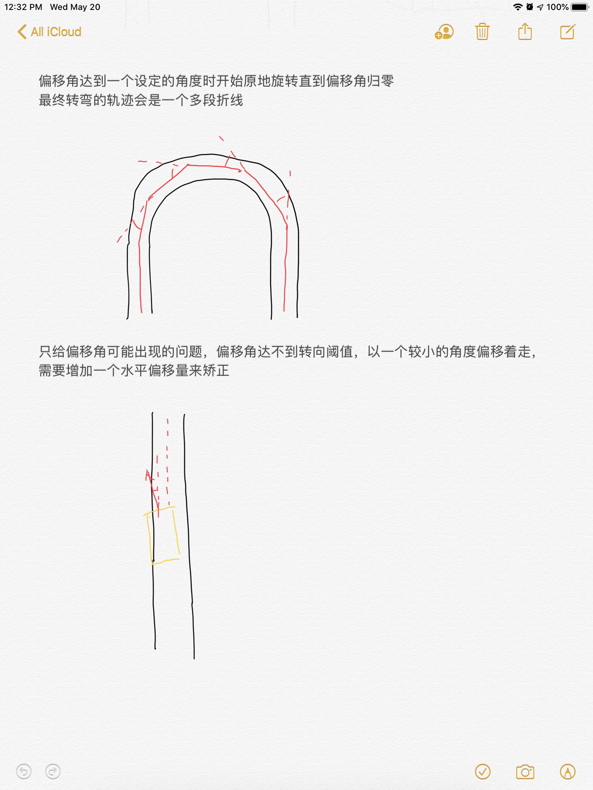

### update chassis.py(2020/5/23)

#### description:

- update turning command

#### codes:

```python
import time

from colored import commandInfo, debugInfo, detectedInfo, info


class MotorsGroup(object):
    '''
    rover motor interface
    '''

    def __init__(self):
        pass

    def update(self, velocityDict):
        '''
        `velocityList`: list of velocity to set to motors
        '''
        for motor in velocityDict:
            self.motors[motor].setVelocity(velocityDict[motor])


class WebotsMotorsGroup(MotorsGroup):
    '''
    webots rover motor interface
    '''

    def __init__(self, robot):
        super().__init__()

        timestep = int(robot.getBasicTimeStep())

        # enable motors
        self.motors = {}
        self.motors['arm'] = robot.getMotor('arm')
        # wheel
        self.motors['wheel1'] = robot.getMotor('wheel1')
        self.motors['wheel2'] = robot.getMotor('wheel2')
        self.motors['wheel3'] = robot.getMotor('wheel3')
        self.motors['wheel4'] = robot.getMotor('wheel4')
        for motor in self.motors:
            self.motors[motor].setPosition(float('inf'))
            self.motors[motor].setVelocity(0.0)

    def update(self, velocityDict):
        return super().update(velocityDict)


class Controller(object):
    '''
    chassis controller
    '''

    def __init__(self):
        self.velocityDict = {}
        self.defaultVelocity = 30
        self.maxVelocity = 50
        info('Chassis initialed')

    def set_queue(self, command_queue, motors_queue):
        self.command_queue = command_queue
        self.motors_queue = motors_queue

    def recv_command(self):
        '''
        return the received command from command_queue\n
        the return value will be `''` if command_queue is empty
        '''
        while not self.command_queue.empty():
            return self.command_queue.get()
        else:
            return ''

    def set_state(self, command):
        '''
        set state of the chassis by command, a commandInfo will output
        '''
        # clean state
        for motor in self.velocityDict:
            self.velocityDict[motor] = 0

        if command:
            if command == 'Rotate arm':
                self.state = 'Arm rotating'
                self.velocityDict['arm'] = 10
            # wheel
            if command[:4] == 'Turn' and command[:5] != 'Turn ':
                shift = float(command[4:]) * 10
                self.state = command
                self.velocityDict['wheel1'] = self.defaultVelocity + shift
                self.velocityDict['wheel2'] = self.defaultVelocity + shift
                self.velocityDict['wheel3'] = self.defaultVelocity - shift
                self.velocityDict['wheel4'] = self.defaultVelocity - shift

            if command == 'Move forward':
                self.state = 'Moving forward'
                self.velocityDict['wheel1'] = self.defaultVelocity
                self.velocityDict['wheel2'] = self.defaultVelocity
                self.velocityDict['wheel3'] = self.defaultVelocity
                self.velocityDict['wheel4'] = self.defaultVelocity

            if command == 'Move backward':
                self.state = 'Moving backward'
                self.velocityDict['wheel1'] = -self.defaultVelocity
                self.velocityDict['wheel2'] = -self.defaultVelocity
                self.velocityDict['wheel3'] = -self.defaultVelocity
                self.velocityDict['wheel4'] = -self.defaultVelocity

            if command == 'Turn right':
                self.state = 'Turning right'
                self.velocityDict['wheel1'] = self.defaultVelocity
                self.velocityDict['wheel2'] = self.defaultVelocity
                self.velocityDict['wheel3'] = -self.defaultVelocity
                self.velocityDict['wheel4'] = -self.defaultVelocity

            if command == 'Turn left':
                self.state = 'Turning left'
                self.velocityDict['wheel1'] = -self.defaultVelocity
                self.velocityDict['wheel2'] = -self.defaultVelocity
                self.velocityDict['wheel3'] = self.defaultVelocity
                self.velocityDict['wheel4'] = self.defaultVelocity

            if command == 'Stop':
                self.state = 'Stopped'
                self.velocityDict['wheel1'] = 0
                self.velocityDict['wheel2'] = 0
                self.velocityDict['wheel3'] = 0
                self.velocityDict['wheel4'] = 0

            for item in self.velocityDict:
                if self.velocityDict[item] < -self.maxVelocity:
                    self.velocityDict[item] = -self.maxVelocity
                if self.velocityDict[item] > self.maxVelocity:
                    self.velocityDict[item] = self.maxVelocity
                self.velocityDict[item] = -self.velocityDict[item]

            self.motors_queue.put(self.velocityDict)
            commandInfo(self.state)

    def run(self, flag_pause):
        '''
        `flag_pause`: the flag to pause this Decider running (actually skips all code in this function)\n
        '''
        while True:
            # time.sleep(0.1)  # set chassis period to 0.1s
            # skip all code inside if paused by webots
            if not flag_pause.value:
                self.set_state(self.recv_command())


if __name__ == "__main__":
    pass
```

### improved feeder(2020/5/24)

#### description:

- a new feeder consisting three rotating motors

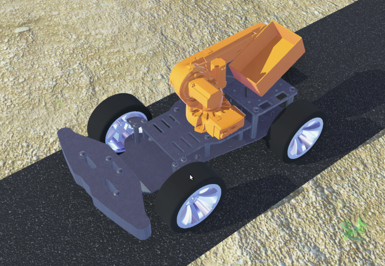

### update chassis.py(2020/5/26)

#### description:

- define feeding command
  - release fish food
  - retract arm

#### codes:

```python
import queue
import time

from colored import commandInfo, debugInfo, detectedInfo, info


class MotorsGroup(object):
    '''
    rover motor interface
    '''

    def __init__(self):
        pass

    def update(self, velocityDict):
        '''
        `velocityList`: list of velocity to set to motors
        '''
        for motor in velocityDict:
            self.motors[motor].setVelocity(velocityDict[motor])


class WebotsMotorsGroup(MotorsGroup):
    '''
    webots rover motor interface
    '''

    def __init__(self, robot):
        super().__init__()

        timestep = int(robot.getBasicTimeStep())

        # enable motors
        self.motors = {}
        self.motors['A motor'] = robot.getMotor('A motor')
        self.motors['B motor'] = robot.getMotor('B motor')
        self.motors['C motor'] = robot.getMotor('C motor')
        # wheel
        self.motors['wheel1'] = robot.getMotor('wheel1')
        self.motors['wheel2'] = robot.getMotor('wheel2')
        self.motors['wheel3'] = robot.getMotor('wheel3')
        self.motors['wheel4'] = robot.getMotor('wheel4')
        for motor in self.motors:
            self.motors[motor].setPosition(float('inf'))
            self.motors[motor].setVelocity(0.0)

    def update(self, velocityDict):
        return super().update(velocityDict)


class Controller(object):
    '''
    chassis controller
    '''

    def __init__(self):
        self.velocityDict = {}
        self.defaultVelocity = 8
        self.maxVelocity = 10
        self.steer_coefficient = 0.5
        info('Chassis initialed')

    def set_queue(self, command_queue, motors_queue):
        self.command_queue = command_queue
        self.motors_queue = motors_queue

    def recv_command(self):
        '''
        return the received command from command_queue\n
        the return value will be `''` if command_queue is empty
        '''
        command = ''
        while True:
            try:
                command = self.command_queue.get(block=True, timeout=0.05)
            except queue.Empty:
                break
        return command

    def set_state(self, command):
        '''
        set state of the chassis by command, a commandInfo will output
        '''
        # clean state
        for motor in self.velocityDict:
            self.velocityDict[motor] = 0

        if command:
            if command == 'Feed':
                self.state = 'Feeding'
                self.velocityDict['A motor'] = 1
                self.velocityDict['B motor'] = 1
                self.velocityDict['C motor'] = 1
                
            if command == 'Feeder recover':
                self.state = 'Feeder recovering'
                self.velocityDict['A motor'] = -1
                self.velocityDict['B motor'] = -1
                self.velocityDict['C motor'] = -1

            # wheel
            if command[:4] == 'Turn':
                steer = float(command[4:]) * self.steer_coefficient
                self.state = 'Steering speed: ' + str(steer)
                self.velocityDict['wheel1'] = self.defaultVelocity + steer
                self.velocityDict['wheel2'] = self.defaultVelocity + steer
                self.velocityDict['wheel3'] = self.defaultVelocity - steer
                self.velocityDict['wheel4'] = self.defaultVelocity - steer

            if command == 'Move forward':
                self.state = 'Moving forward'
                self.velocityDict['wheel1'] = self.defaultVelocity
                self.velocityDict['wheel2'] = self.defaultVelocity
                self.velocityDict['wheel3'] = self.defaultVelocity
                self.velocityDict['wheel4'] = self.defaultVelocity

            if command == 'Move backward':
                self.state = 'Moving backward'
                self.velocityDict['wheel1'] = -self.defaultVelocity
                self.velocityDict['wheel2'] = -self.defaultVelocity
                self.velocityDict['wheel3'] = -self.defaultVelocity
                self.velocityDict['wheel4'] = -self.defaultVelocity

            if command == 'Stop':
                self.state = 'Stopped'
                self.velocityDict['wheel1'] = 0
                self.velocityDict['wheel2'] = 0
                self.velocityDict['wheel3'] = 0
                self.velocityDict['wheel4'] = 0

            for item in self.velocityDict:
                if self.velocityDict[item] < -self.maxVelocity:
                    self.velocityDict[item] = -self.maxVelocity
                if self.velocityDict[item] > self.maxVelocity:
                    self.velocityDict[item] = self.maxVelocity
                self.velocityDict[item] = -self.velocityDict[item]

            self.motors_queue.put(self.velocityDict)
            # commandInfo(self.state)

    def run(self, flag_pause):
        '''
        `flag_pause`: the flag to pause this Decider running (actually skips all code in this function)\n
        '''
        while True:
            time.sleep(0.1)  # set chassis period to 0.1s
            self.set_state(self.recv_command())


if __name__ == "__main__":
    pass
```

