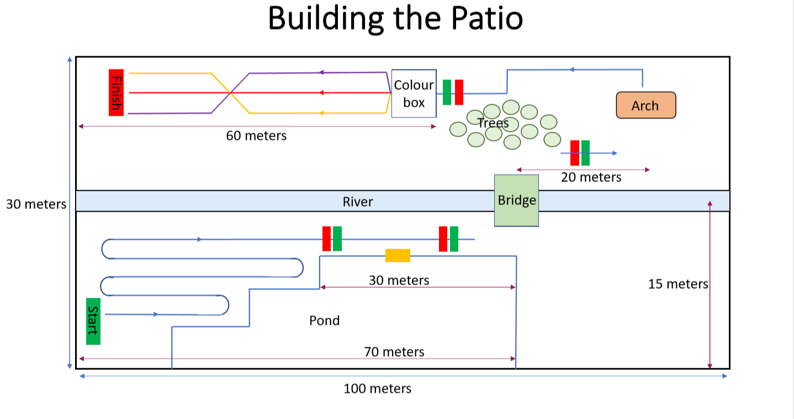
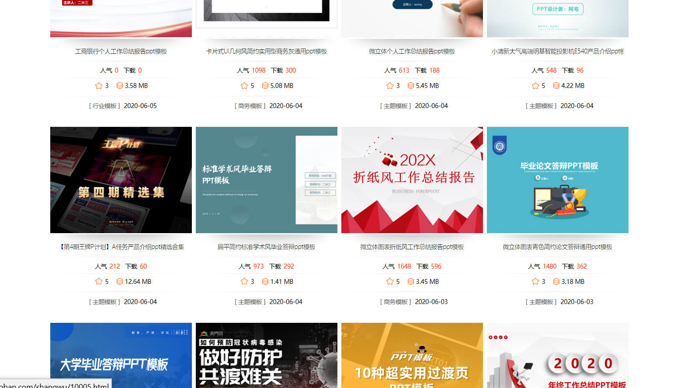
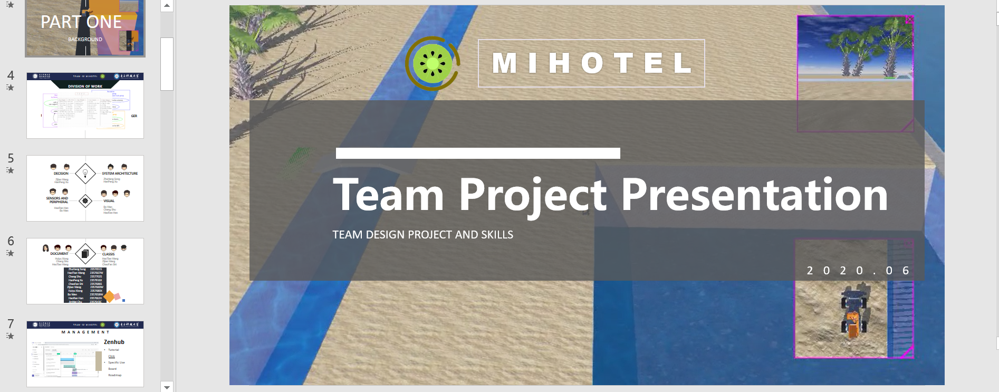
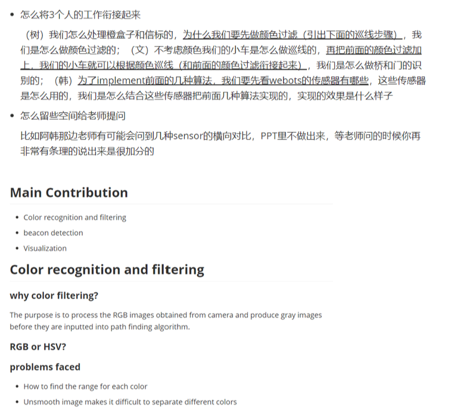

### Table of Content

1. [Subject: Learn GitHub and Other Online Tools](#Learn-GitHub-and-Other-Online-Tools)
2. [Subject: The Requirements of Environment](#Subject-The-Requirements-of-Environment)
3. [Subject: Organize and Summarize the Contents of Notebook](#Subject-Organize-and-Summarize-the-Contents-of-Notebook)
4. [Subject: Overall Planning of Defense PPT](#Subject-Overall-Planning-of-Defense-PPT)
5. [Subject: Conference Records](#Subject-Conference-Records)

---
### Subject: Learn GitHub and Other Online Tools

#### Date: <u>March 18</u>   Author: <u>Huiyu Xiong</u>

##### Purpose: 

Learn to use online communication tools to make team management easier and more efficient. It is convenient for many people to share code remotely.

##### Procedure:

>This session is divided into two parts:
>1. Unified learning through group meetings
>2. Browse the forum and search for vegetarian courses

##### Experiment:

Browse the following information:

[Chinese Translation: Official course](https://www.jianshu.com/p/548ff8e4f7cb).

[Guide to GIT and GitHub](https://www.jianshu.com/p/296d22275cdd).

[Detailed tutorial for novice](https://blog.csdn.net/Hanani_Jia/article/details/77950594).

[Git Guide](https://blog.csdn.net/qq_34964197/article/details/81104419).

And carefully read the conference recording frequency, familiar with the basic operation of GitHub and zenhub.

##### Results:

I can use GitHub skillfully and upload some files and materials in it. I often use the markdown file to record the experiments of TDPs courses, and regularly check the experimental data of other team members to learn about the experimental dynamics of others.

------

### Subject: The Requirements of Environment

#### Date: <u>April 13</u>   Author: <u>Huiyu Xiong</u>

##### Purpose: 

Make clear the requirements of setting up environment and find out what models we need to build in the world.

##### Procedure:

Browse the courseware and MS team messages given by the teacher. Sort out and summarize the outline of exchange.

##### Experiment:



- Max.Size for robot: 50cm * 50cm
- From start, you can draw some leading lines so that the robot can follow; there is an orange beacon or box on the edge of the pond, where fish will be fed
- Bridge: 100cm wide * 3M long, including ramps for up and down the bridge
- After crossing the bridge, there are several trees scattered randomly, which need to be avoided and turned right
- The arch should be slightly larger than the robot. The recommended size of arch is 100cm (W) x 100cm (H)
- Find the arch, cross it, and follow the line on the ground. Arches can be found on the ground with signs or beacons
- The middle of the bridge will line up with the edge of the pond, you should find the bridge and go through it, then find the tree and right
- After passing the arch, follow the line of the ground and turn right to avoid colliding with the trees
- The robot should move to the color box
- After the robot reads the color of the box, the robot should be able to follow the correct color until it reaches finish. You can set colors manually or automatically using the random color generator

##### Results:

From the above outline, we can intuitively find all models that need to be built in the world. The details covered include not only dimensional requirements but also location information. Make our subsequent environment more accurate and meet customer needs.

------

### Subject: Organize and Summarize the Contents of Notebook

#### Date: <u>April 21</u>   Author: <u>Huiyu Xiong</u>

##### Purpose: 

As this is our first team work project, we are not familiar with taking experimental notes. This experiment aims to sort out the teacher's requirements for notebook and make an outline. Help you to complete the notebook more efficiently. And find a convenient way of online communication, so that everyone can quickly exchange learning content, and even realize cooperation projects remotely.

##### Procedure:

Browse the courseware and MS team messages given by the teacher. Sort out and summarize the outline of exchange. Find an open source platform and build the GitHub Library of the team. In this warehouse, many groups are set up to facilitate the exchange of experience and record the experimental process. Finally, in the readme file, we briefly describe the notebook recording rules and precautions.

##### Experiment:

 [OUTLINE OF NOTEBOOK](https://github.com/TDPS-Mihotel/NOTEBOOK/blob/master/README.md).

About notebook, we use github to finish it.

There are 7 repositories：
The first repository, named Mihotel, is mainly the overall planning of the whole project. We have two branches here. One is the former physical one（hardware）, and the other is the current master one. （simulation) We can get the version changes from the submission infor.. 

And bout the banch:     
	• The details and requirements of some tasks are listed.            
	• Selection of configuration            
	• Sorting out task requirements            
	• expense list

The second repository, notebook, is our daily lab record.
	• we first sorted out the outline of the experimental record according to the reference material given by teachers
	•  for each member, record recent experiments following the outline.

Visual path, STM32 learning part, we are still learning, so the data does not hand out into files.
Report, we haven't planned to do this part.

The team work section lists the tools and tutorials. For the convenience of understanding, this part is written in Chinese. The overall project development is constrained.
	• Development specification: file name; punctuation; coding format; language
	• Learning materials: some tutorials (markdown, GitHub, zenhub) to help us to manage the project; tutorials of tools needed for project development (VSC, SSH, phyhon)

The last repository named playground is given to try how to use git and github. Because not all of people in our group have used it before.

##### Results:

Through the use of GitHub open-source online platform, our project cooperation is more convenient and efficient. Upload notes to GitHub's library to help us understand the experimental process and results of team members in real time, so as to make remote communication more smooth.

------

### Subject: Overall Planning of Defense PPT

#### Date: <u>May 24</u>   Author: <u>Huiyu Xiong</u>

##### Purpose: 

As the defense is one of the important scoring standards, our group designated me as the head of presentation, master plan the PPT process and the style of slides. The premise of making PPT is to grasp the whole project and sort out the explanation logic suitable for outsiders. Then, learn the tutorial of PPT production, make ppt more beautiful, and highlight the main purpose. At last, the main points of all the students' explanations are sorted out and presented on the limited PPT.

##### Procedure:

At the beginning of the course, I began to learn how to make exquisite PPT in Zhihu, BiliBili app, CSDN and other forums. Then, I asked my former senior and senior sister about the important points of presentation and PPT. Then, through regular group meetings, I discussed with the team members about the content of PPT and determined the outline of PPT. Finally, I collated and summarized the materials provided by the team members, completed the whole ppt production, and chatted with the team members one by one to ensure that the rigor and beauty of the materials coexist.

##### Experiment:

**Outline**
``` markdown
	• background+Partition of patio tasks
		○ need partners who may be familiar with the whole project
	• division of work
	• management（Github)
	• group elaboration (picture + presentation points)
		○ First discuss in the group, and then sort out the main points to be told
		○ give as many pictures as possible, and then mark the pictures displayed and the pictures to be highlighted, because the size may be different. For the pictures that are not available, it may not be used if the layout is not enough
	• summary (what TDPs we learned)
		○ Complete according to the next meeting
```


_Query and Learn Excellent PPT Templates_


_The Process of Making PPT_


_Sorting and Linking PPT Logic_

##### Results:

Finally, it presents a beautiful PPT, ready for the presentation on June 8. The animation is fluent, the connection is full of logic, the expression is accurate and in place, and the graphic and text are combined. Let the teacher understand our project intuitively.

------

### Subject: Conference Records

#### Date: <u>June 5</u>   Author: <u>Huiyu Xiong</u>

##### Purpose: 

Rehearse the presentation and improve the preparation. Be familiar with MS team's real-time meeting in advance, and learn remote control and other operations. It is convenient to modify the question before the formal reply, and then optimize the presentation.

##### Procedure:

>This session is divided into two parts:
>1. Demonstrate and explain the car on webots
>2. Use PPT to talk about team contribution in groups and members and answer the questions raised by teachers

##### Experiment:

**Simulation**
``` markdown
During the video presentation, explain the following points:
	• Two cameras
	• Trolley structure
	• Different curves
	• Orange Box
	• Strong recognition ability (duck)
	• How to keep going after the road (Compass)
	• Bridge (see picture later)
	• Green beacon (considering not hitting trees)
	• Continue to follow the compass
	• Detect the door, and then switch to patrol line (the door is much smaller than the required size)
	• Color box switch graph, shield other colors, narrow path
	• Cross part recognition
```

**Slide**
``` markdown
During the PPT presentation, we should focus on points:
	• There should be a logical relationship between the cohesion within sub groups and between sub groups
	• Improper use of some pictures
	• Detailed distribution of explanations by some members
	• Arrangement order of summary page
	• The use of remote control in MS team
	• Grasp the whole process of slide show
```

##### Results:

Have an early understanding of the presentation on June 8 and improve on the preparation deficiencies. We will improve the presentation of projects and strive for better results.

------
