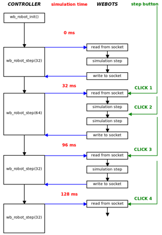
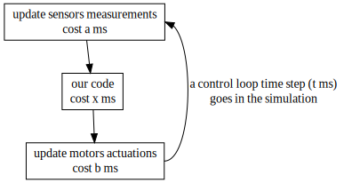
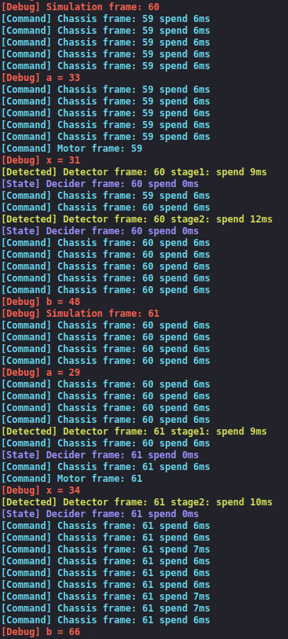

### Table of Content

1. [2020.03.11 System Selection](#20200311-System-Selection)
2. [2020.03.20 Environment Selection](#20200320-Environment-Selection)
3. [2020.03.20 Environment Setup](#20200320-Environment-Setup)
4. [2020.04.21 Framework Setup](#20200421-Framework-Setup)
5. [2020.04.22 Windows Only Bug Fixing](#20200422-Windows-Only-Bug-Fixing)
6. [2020.04.28 Multiprocessing Webots Controller](#20200428-Multiprocessing-Webots-Controller)
7. [2020.04.29 Plain Output in Webots on Windows Fixing](#20200429-Plain-Output-in-Webots-on-Windows-Fixing)
8. [2020.04.30 Real Rover & Webots Rover Compatibility](#20200430-Real-Rover--Webots-Rover-Compatibility)
10. [2020.05.13 Webots Devices Access Fixing](#20200513-Webots-Devices-Access-Fixing)
17. [2020.06.02 Refactor and Performance](#20200602-Refactor-and-Performance)

---

## 2020.03.11 System Selection

| Experiment Title   | System Selection                                |
| ------------------ | ----------------------------------------------- |
| Experiment Purpose | Decide architecture of the system               |
| Keyword            | Multi-processing, Multi-threading, Architecture |
| Conclusion         | Decide to design a multiprocessing system.      |
| Issues             | /                                               |


There is no doubt that a whole control process goes like this:

1. Abstract data from sensors into signals to show state of the rover

2. Make decision of following behavior depending on current state

3. control the rover to do the required behavior

Since here we do not have very complex situations to make decisions and we do not have to very complex tasks to do, it is obvious that **each stage takes different amount of time**. I suppose **Perception** takes a lot time, while time cost by **Decision** stage may be really short that we could even ignore it. In addition, **Control** stage actually need an **separate**, **high frequency** loop to keep high precision control of the rover.

Therefore, we need three separate loops:

- A perception loop keeps processing sensors data and transmit signals to decision loop. It should send out signals every time a signal is updated, but not send once when all signals are updated. In this way, we could always do decisions with the latest signals.
- A decision loop keeps sending commands to control loop depending on signals received from perception loop.
- A control loop keeps controlling the rover to act like what the decision loop asks to do, for example apply a PID control on velocity of four wheels.

Then we found two normal ways to allow three separate loops in one program:

1. multi-processing
2. multi-threading

After some research we found that:

> If your program is a **CPU intensive** application, multi-processing is recommended, While multi-threading is more suitable for **I/O intensive** applications.

- A CPU intensive application is: for example, which has lots of loops or calculating steps.
- A I/O intensive application is: for example, mainly deal with files, or a web crawler.

Since multi-threading is running concurrently, most implements use a counter to decide whether switch to another thread. Therefore a CPU intensive application could reaches the counter threshold very soon, and need to compete for time to execute again.

On the other hand, for I/O intensive applications which have lots of situations where has to wait for **external** events, multi-threading could save a lot of resource, as for these situations, we could switch to another thread.

Given this, we decide to design a **multiprocessing** system.

## 2020.03.20 Environment Selection

| Experiment Title   | Environment Selection                               |
| ------------------ | --------------------------------------------------- |
| Experiment Purpose | Decide the development tool chain and their version |
| Keyword            | Python, OpenCV, Raspberry Pi                        |
| Conclusion         | Python is selected as the main programming language |
| Issues             | Performance of RPi4 need to be tested               |

Since our program does not have strict requirement on speed, factors of programming language selection of our program are:

- easy to get start with, because we could not find a language that everyone in the team are familiar with
- easy to configure the tool chain
- easy to develop and debug
- has powerful library to process images, so we do not have to start from very beginning
- allow running the program just on our own computers but not only on the rover, so that everyone could get involved in

Considering all factors above, we decide to select **Python** as programming language of our program.

So the configuration is as follow:

| Item     | Argument                                                     |
| -------- | ------------------------------------------------------------ |
| Board    | [Raspberry Pi 4b](https://www.raspberrypi.org/products/raspberry-pi-4-model-b/specifications/) |
| System   | [Raspbian Buster](https://www.raspberrypi.org/downloads/raspberry-pi-os/) |
| Language | [Python](https://www.python.org/) 3.7.3                      |
| OpenCV   | [opencv-contrib-python](https://pypi.org/project/opencv-contrib-python/) 4.2.0.34 |

## 2020.03.20 Environment Setup

| Experiment Title   | Framework Setup                                              |
| ------------------ | ------------------------------------------------------------ |
| Experiment Purpose | setup specified environment and write a shell script to do that, then test performance of RPi4 |
| Keyword            | shell, configuration, Linux, RPi4                            |
| Conclusion         | Performance of RPi4 is totally wonderful                     |
| Issues             | /                                                            |


A bash script to auto setup the environment on RPi4 is written:

```bash
#! /bin/bash
# ------------------------------------------------------------------------------
# Install essential softwares and packages.
#
# To descrease download speed apt source and Raspbian source are changed to
# tsinghua. Another side effect is that default pip and python are changed to
# pip3 and python3.
#
# ❗Notice that you should download the spefified opencv-contrib-python wheel
# file to **Desktop** before executing it. (you can get download link in README)
# ------------------------------------------------------------------------------

# backup apt source list and Raspbian source list and change them to tsinghua mirror
sudo cp /etc/apt/sources.list /etc/apt/sources.list.bak
sudo cp /etc/apt/sources.list.d/raspi.list /etc/apt/sources.list.d/raspi.list.bak
sudo sh -c 'echo "deb http://mirrors.tuna.tsinghua.edu.cn/raspbian/raspbian/ buster main non-free contrib" > /etc/apt/sources.list'
sudo sh -c 'echo "deb-src http://mirrors.tuna.tsinghua.edu.cn/raspbian/raspbian/ buster main non-free contrib" >> /etc/apt/sources.list'
sudo sh -c 'echo "deb http://mirrors.tuna.tsinghua.edu.cn/raspberrypi/ buster main ui" > /etc/apt/sources.list.d/raspi.list'
sudo apt update

# remove the soft links to pip2 and python2
sudo rm /usr/bin/pip
sudo rm /usr/bin/python
# then install update-alternatives
sudo update-alternatives --install /usr/bin/pip pip /usr/bin/pip3 1
sudo update-alternatives --install /usr/bin/python python /usr/bin/python3 1

# change to tsinghua pip mirror and upgrade pip
pip config set global.index-url https://pypi.tuna.tsinghua.edu.cn/simple
pip install pip -U

# install OpenCV and its dependencies
sudo apt-get install -y libhdf5-dev libhdf5-103
sudo apt-get install -y libqtgui4 libqtwebkit4 libqt4-test python3-pyqt5
sudo apt-get install -y libatlas-base-dev
sudo apt-get install -y libjasper-dev
pip install ~/Desktop/opencv_contrib_python-4.1.0.25-cp37-cp37m-linux_armv7l.whl  # ❗this wheel file has to be there first
```

The performance of RPi4 is proved to be very high, as the CPU usage of RPi4 is only about 25% when I watch 1080P video in browser on it. Its performance is far higher than RPi3b+. We do not need to worry about this any more.

## 2020.04.21 Framework Setup

| Experiment Title   | Environment Selection                      |
| ------------------ | ------------------------------------------ |
| Experiment Purpose | work out the basic framework of the system |
| Keyword            | Python, Module, Class, Queue               |
| Conclusion         | My design seems feasible                   |
| Issues             | /                                          |

To make it easy for subgroups to develop their code separately, and also make it easier to call in the main process, we decide to abstract code of each stage into a class, and put them into different modules, that is to say, different files.

That is:

- **chassis** module: `Controller` class
- **decision** module: `Decider` class
- **detection** module: `Detector` class

[multiprocessing.Queue()](https://docs.python.org/3/library/multiprocessing.html#multiprocessing.Queue) is used to communicate between processes. Although according to a [Stack Overflow answser](https://stackoverflow.com/a/8463046/10088906), **`multiprocessing.Pipe()` performs much faster**, but `Queue()` seems more easy to write, so use `Queue()` to communicate between processes for the present. There seems to be no delay in the queues so far.

The system structure now is:


Code in the main process looks like this:

```python
# define the processes
def move(movement_queue):
    rover = chassis.Chassis()
    while True:
        if not movement_queue.empty():
            rover.set_state(movement_queue.get())


def sense(sense_queue):
    detector = sensor.Sensor()
    detector.run(sense_queue)


def decide(sense_queue, move_queue):
    decider = decision.Decision()
    decider.run(sense_queue, move_queue)


start = time.time()
info('start at:' + str(start))
# create pipes
move_queue = multiprocessing.Queue()
sense_queue = multiprocessing.Queue()

# create processes and start them
move_process = multiprocessing.Process(target=move, args=(move_queue, ))
sense_process = multiprocessing.Process(target=sense, args=(sense_queue, ))
decide_process = multiprocessing.Process(target=decide, args=(sense_queue, move_queue,))
move_process.daemon = True
sense_process.daemon = True
decide_process.daemon = True
move_process.start()
sense_process.start()
decide_process.start()

while True:
    # now use time to be finish flag signal
    if time.time() - start > 1:  # 1s
        flag_finish_patio = 1
    if flag_finish_patio:
        break
```

## 2020.04.22 Windows Only Bug Fixing

| Experiment Title   | Framework Setup                                             |
| ------------------ | ----------------------------------------------------------- |
| Experiment Purpose | fix a Windows only bug related to multiprocessing in Python |
| Keyword            | Multi-processing, Windows, Module                           |
| Conclusion         | It seems Windows does not support multiprocessing that well |
| Issues             | /                                                           |

When running the code above on Windows, got following error message:

``` shell
RuntimeError:
An attempt has been made to start a new process before the current
process has finished its bootstrapping phase.
```

After some research found out that lines related to multiprocessing need to be under `if __name__ == "__main__"`

## 2020.04.28 Multiprocessing Webots Controller

| Experiment Title   | Multiprocessing Webots Controller                            |
| ------------------ | ------------------------------------------------------------ |
| Experiment Purpose | try to merge our multiprocessing framework into webots controller |
| Keyword            | Webots, Multiprocessing                                      |
| Conclusion         | We are able to design a multiprocessing webots controller now, but this implement does not looks decent |
| Issues             | I do not know if there is a better way to do it, and I do not know if this implement introduces any bugs... |

According to webots's description of [relationship between simulation step and control step](https://cyberbotics.com/doc/guide/controller-programming#the-step-and-wb_robot_step-functions), the behavior of the robot is controlled by the code in the control loop, and take affect after `wb_robot_step()` is called. And if the main loop does not start with `wb_robot_step()`, we could not stop the control loop while <kbd>pause</kbd> is pressed in webots. It seems webots does not provide support for multiprocessing, so we have to make a workaround by ourselves.

To pause all processes when the <kbd>pause</kbd> button is presses in webots, a variable `flag_pause` allocated from shared memory is used. This variable is created with [multiprocessing.Value()](https://docs.python.org/2/library/multiprocessing.html#multiprocessing.Value). The initial value of this flag is **True**, and is set to **False** at the end of main loop in the main process, to indicate that this loop is not paused in webots, so every child process are allowed to execute once. Then in the decider process this flag is set to **True** again to show a loop has done, and is waiting for next time step.

So the main loop of the main process looks like this:

```python
if __name__ == "__main__" and flag_simulation:
    from controller import AnsiCodes, Robot
    # create the Robot instance.
    robot = Robot()
    # get the time step of the current world.
    timestep = int(robot.getBasicTimeStep())
    # Main loop:
    # - perform simulation steps until Webots is stopping the controller
    while robot.step(timestep) != -1:
        # resume decider process
        with lock:
            flag_pause.value = False
```

The main loop of the decider process looks like this:

```python
while True:
    if not (signal_queue.empty() or flag_pause.value):
        self.detected = signal_queue.get(True)
        detectedInfo('time:' + str(self.detected))
        command_queue.put('move straight forward')
        with lock:
            flag_pause.value = True
```

## 2020.04.29 Plain Output in Webots on Windows Fixing

| Experiment Title   | Plain Output in Webots on Windows Fixing    |
| ------------------ | ------------------------------------------- |
| Experiment Purpose | figure out the reason and then fix this bug |
| Keyword            | ANSI, Windows                               |
| Conclusion         | Leaving output in Webots on Windows plain   |
| Issues             | This is a bug of webots console             |

https://github.com/TDPS-Mihotel/Mihotel/commit/8771398c14971b905962861cb1de8c545d6c52fc

According to [document of colorama](https://github.com/tartley/colorama#initialisation):

> On Windows, calling `init()` will filter ANSI escape sequences out of any text sent to **stdout** or **stderr**, and replace them with equivalent Win32 calls.

After testing, the colorful output works fine in cms and PowerShell, However, according to [document of the ANSI escape codes support feature](https://github.com/cyberbotics/webots/blob/develop/docs/guide/controller-programming.md#console-output) webots 2020b provides, we should not convert ANSI escape sequences to Win32 calls even on Windows when running in webots console. So I tried limit to call `colorama.init()` only when on Windows and webots not running. The output could be colorful now, but then a wired bug happens: output would stuck after a few lines. I did not figure out why this happens, I suppose this is a bug of webots. So let's leave output in Webots on Windows plain.

## 2020.04.30 Real Rover & Webots Rover Compatibility

| Experiment Title   | Real Rover & Webots Rover Compatibility                      |
| ------------------ | ------------------------------------------------------------ |
| Experiment Purpose | try to allow one piece of code works for both real rover and webots rover |
| Keyword            | psutil, environment variable                                 |
| Conclusion         | This is still just a workaround, not decent enough.          |
| Issues             | I do not know if it is simple to specifically write code for a simulation robot... |

Since I think it could be wired that we have to write code for real rover and webots rover separately, I try to add some conditions in the code to allow one piece of code could work for both real rover and webots rover. By doing so, we could reduce the difference between behavior of rover in real world and simulation to the minimum.

I first tried to detect whether the program is run as a simulation by checking if there is webots specific environment variables, but I then find I does not work for running the simulation with an external controller.

[With the help of developer of webots](https://github.com/cyberbotics/webots/issues/1602), I decide to check whether there is a process, which name includes **webots**. This works for both Linux and Windows:

```python
import psutil
flag_simulation = len([p.name() for p in psutil.process_iter() if 'webots' in p.name()])
```

## 2020.05.13 Webots Devices Access Fixing

| Experiment Title   | Webots Devices Access Fixing                                 |
| ------------------ | ------------------------------------------------------------ |
| Experiment Purpose | fix access to webots devices                                 |
| Keyword            | Swig, pickle, multiprocessing                                |
| Conclusion         | An ugly workaround which introduces two delay                |
| Issues             | It seems there is support for C but not Python. Since webots choose to use Swig, it is not easy to fix. |

https://github.com/TDPS-Mihotel/Mihotel/commit/ba8d1d9142acb6e8fdff722719e9e387dfd5453b

https://github.com/TDPS-Mihotel/Mihotel/commit/84fbc64524f766934a4cac060e2ea5d5363b4294

Since variables are not shared between processes by default, the three child processes could not access the webots `robot` instance so far. The problem is, this instance could not be transfered to other processes. I tried `multiprocessing.Queue()`, but I got:

```shell
TypeError: can't pickle SwigPyObject objects
```

Since this instance is a **SwigPyObject** which could not be pickled, we could not pass this variable to another process by any method. Therefore I add two queues:

- a `sensors_queue` to transfer data from webots sensors to the detector process
- a `motors_queue` to transfer motors velocity to set to the webots motors from the controller process to the main process.

So the system looks like this now:


## 2020.06.02 Refactor and Performance

| Experiment Title   | Refactor and Performance                                     |
| ------------------ | ------------------------------------------------------------ |
| Experiment Purpose | refactor the code and try to improve the performance         |
| Keyword            | delay, simulation time step, multiprocessing                 |
| Conclusion         | with the help of multiprocessing, we could significantly improve the simulation speed with acceptable delay |
| Issues             | /                                                            |

https://github.com/TDPS-Mihotel/Mihotel/commit/b0b035c62b241ffe9d51122a44ee14f89aec20db



I finally understand what this graph what to say: every time `wb_robot_step()` is called in controller, the time step specified in `wb_robot_step()` passes in simulation. That means, **time cost in a control loop does not influent the simulation result at all.** It only influent the simulation speed. The equation is: $simulation\ speed=\frac{control\ loop\ time\ step}{time\ spent\ in\ a control\ loop}$



In our case, it means: $simulation\ speed=\frac{t}{x+a+b}$

Suppose $\overline a$ and $\overline b$ do not change significantly when t various, just depend on the performance of computer, then we can see that the simulation could be faster with larger control loop time step, less time cost by our code.

Since large control loop time step leads to slow response, set it to a reasonable length, twice of `BasicTimeStep`, 32ms.

In addition, since we are using multiprocessing, we can isolate the time cost by our code from the time a control loop spent.

So I design the cycle like this:


The **detector process** will process sensors data and send all signals to the **decider process** every time a signal is updated, then the **decider process** will send command to the **controller process**, where the command is parsed into a dictionary of motors velocity. In addition, no matter a command is sent to **controller process** or not, it will send the motors velocity dictionary to the main process once every 5 ms. And before receiving the motors velocity dictionary, the main process will be blocked for 20ms, leave time for the three processes to do the work. Therefore, the simulation speed is now $\frac{32}{30+a+b}$, almost the best we could do, since we could not reduce a and b from the code. According to my test, value of $a+b$ could vary **from 0ms to 70ms**.

Here is the result:



We can see from the output that there is at most delay of one frame between the simulation and motors velocity, which means in the simulation the motors velocity has a delay of 32ms. This is acceptable for our program.